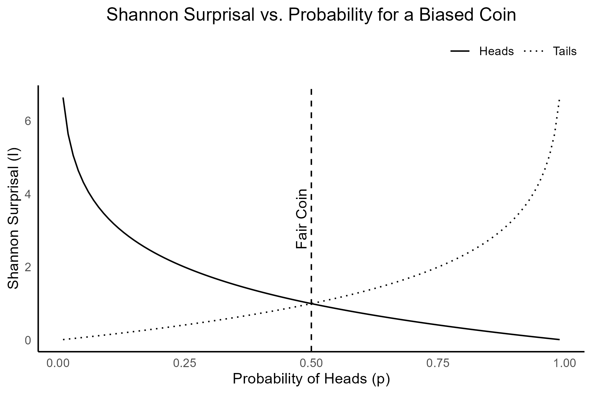

<!-- ## Introduction

...

* Quantitative approaches in archaeology beginning with Petrie's application of sequence dating (i.e., seriation) in 1899 [@Kendall1969].
* It was not until the 1950s that formal statistical methods started to play a more substantial role in archaeological methodologies [@Ammerman1992]. Early work by archaeologists such as @Brainerd1951, @Spaulding1953, and @Heizer1956 foreshadowed an emergent *computational archaeology* [@Djindjian2015].
* By the 1970s
* 

Fifty years ago, what arguably could have been one of the most important papers written for modern work in quantitative archaeology was published in American Antiquity. Unfortunately for its author, and generations of archaeologists, it received relatively little attention at the time. With few citations, more than half of which have occurred in just the last few years, its elegance and mathematical precision went largely unappreciated.

John Justeson's article "Limitations of archaeological inference: an information-theoretic approach with applications in methodology" [-@Justeson1973] was rather ambitious, as can be seen from its abstract:

> "A framework is established for the application of information-theoretic concepts to the study of archaeological inference, ultimately to provide an estimate of the degree to which archaeologists, or anthropologists in general, can provide legitimate answers to the questions they investigate. Particular information-theoretic measures are applied to the design elements on the ceramics of a southwestern pueblo to show the methodological utility of information theory in helping to reach closer to that limit." [@Justeson1973]

The premise was actually quite straightforward -- behavioral information is "encoded" in the material artifacts deposited within an archaeological site, and the archaeologist's goal is to "decode" that information on the other end. The novelty was that John saw this "encoding-decoding" process as an information flow that could be described by what was (at the time) a relatively esoteric set of mathematical tools known as *information theory*.

The foundations of information theory were developed by Claude Shannon as a way to analyze the transmission of information *independently* of the content of a message.

> "The fundamental problem of communication is that of reproducing at one point either exactly or approximately a message selected at another point. Frequently the messages have meaning; that is they refer to or are correlated according to some system with certain physical or conceptual entities." [@Shannon1948, p.1]

Justeson saw that this approach might also be used to establish an "upper limit" for how interpretable archaeological data could be. Moreover, he demonstrated that we could reasonably calculate a quantifiable *measurement* for that upper limit from those data.

> "If the empirically measured parameters are not consistent with the relationship between them that is required by the theory for a given material or behavioral system, then the data by which that system is to be interpreted cannot have a consistent susceptibility to decoding; that is, there will be no basis for deriving a coherent archaeological interpretation of the data that will accurately reflect the prehistoric situation." [@Justeson1973, p. 136]

In other words, observed archaeological features or attributes should represent a coherent and systematic pattern of activities. If not, then there would be no viable and supportable interpretation for that data available to archaeologists.

In particular, he was addressing two *inherent* limitations of the archaeological record:

1. limitations imposed by the degree of preservation of culturally significant remains and by the skewing of their relationships through time until their recovery; and
2. limitations on the interpretability of archaeological data for the cultural descriptions.

The first limitation is analogous degradation of a signal due to noise or interference affecting a transmission, and the second to the encoding and decoding of that signal between sender and receiver.

@Schiffer1972 had previously elaborated on the distinction between *systemic* and *archaeological* contexts, differentiating between the cultural and taphonomic processes that create the observable archaeological record. It would not be until a decade later [@Schiffer1983; @Schiffer1987] that he would formalize these as *natural* versus *cultural* transformation processes (i.e., $n$-transforms and $c$-transforms). @Justeson1973 ... -->

## A Gentle Introduction to Information Theory

What is now known as "Information Theory" began with a paper written by Claude Shannon, titled "A Mathematical Theory of Communication" [-@Shannon1948], resulting from his work in cryptography at Bell Labs. At the heart of Shannon's theory was the idea that *information* is fundamentally tied to the reduction of *uncertainty*. Shannon approached information not in terms of meaning, but as a measure of the *reduction of uncertainty* within a system of communication.

The influence of telecommunication and cryptography on Shannon's theories are obvious, but the underlying concepts quickly found new applications and implications in other fields of study. By linking information to uncertainty and statistical probabilities, Shannon's abstracted and highly generalized model of information and communication could be adapted to studying all manner of systems. It would not be too long after the theories described in Shannon's technical paper were expanded and republished in a book a year later as "The Mathematical Theory of Communication" [@Shannon1949] that they would begin to appear in disciplines ranging form physics to physiology -- and, of course, archaeology.

### Information, Entropy, and Surprisal

Shannon proposed a particular relationship between information and uncertainty in terms of statistical probabilities. He derived a quantitative measure of that uncertainty derived from the concept of *entropy* used to describe disorder in the thermodynamics of physical systems. Shannon, however, repurposed entropy to refer to the average uncertainty contained in a system  given by the equation:  

\[
    H( \cal{X} ) = - \sum_{i=1}^{n} p(x_i) \ \log_2 \ p(x_i)
\]

What this equation is describing is the total entropy \( H \) of some system \( \cal{X} \) that contains \(n\) discrete attributes or elements \( (x_{1}, x_{2}, \ldots x_{n}) \). The entropy is equal to the negative sum, over all \(n\) features, of each element's probability of occurrence \( p(x_i) \) times the \( \log_2 \)[^fn01] of that probability.

[^fn01]: \( \log_2 \) refers to the base-2 logarithm.

The higher the entropy of a system, indicated by a larger value for $H$, the more uncertainty or randomness there is to the elements of \(\cal{X}\). Somewhat counterintuitively, the more uncertain or random a system the more information it conveys. Remember that Shannon defines information as the reduction of uncertainty. The greater the uncertainty (i.e., high entropy), the more potential information the system is capable of producing because there is greater uncertainty to reduce.

To see how, we need to understand what Shannon defined as *surprisal*. Surprisal, also known as self-information, is a measure of how surprising or unexpected a specific event is based on its probability. In essence, surprisal measures the information content of a specific outcome -- i.e., rare events carry more information than common ones because they are less expected. Low probability events, those that occur infrequently, are highly surprising. Conversely, high probability events are not.

Consider it this way -- if an event is nearly certain to occur, you would *already* be expecting it to happen when it does. Its occurrence tells you nothing that you did not already know. It is only when something happens that we did *not* expect (i.e., we are surprised) that it is providing *new* information. Therefore, surprisal (denoted as \(I(x)\)) is the potential *information* contained in a single event based on its probability \(p(x)\):

\[
    I(x) = - \log_2 p(x)
\]

Surprisal is zero for events that are certain (i.e., the probability \(p(x)=1\)), and grows larger as the probability of the event decreases (Figure {#figure:surprisal_example}). Exceedingly rare events, by contrast, would be very surprising to witness and approaching "infinitely" surprising as the probability of the event goes to zero (i.e., \(lim_{p(x) \to 0} \ I(x) = \infty\)).

{#figure:surprisal_example}

Entropy represents the *average* surprisal over all possible outcomes from a probability distribution. It quantifies the overall uncertainty or unpredictability of a system or source of information. The higher the entropy, the more information the system is capable of producing, since there is greater uncertainty about which outcome will occur.

Entropy is highest when all outcomes are equally likely, and decreases as we gain more information to anticipate whether or not that event is likely to occur (Figure {#figure:entropy_example}). Information is therefore the reduction of that uncertainty or entropy when a new event is observed. We have learned more about the underlying probabilities for future events.

{#figure:entropy_example}

For the first time, scientists had a way to *quantify* information. Shannon had defined information in a way that made it possible to measure and *analyze* it mathematically, based solely on its statistical structure and independently of its content or meaning.

Information theory has evolved over the last few decades into a highly diverse discipline in its own right, with broad applications. Shannon, however, developed the theory towards one particular application -- communication. Specifically, he was looking for a way to understand how information could be efficiently and reliably transmitted across communication systems, especially in the presence of noise or interference.  

### Channel, Signal, and Noise

Under Shannon's model of communication, the relationships between information, channel, signal, noise, and channel capacity define the core aspects for transmitting data effectively. Information represents the content or message that needs to be conveyed, which can vary in complexity. In this context, entropy is a measure of the inherent complexity of the information a message might contain -- i.e., higher entropy indicates greater variability in *potential* messages.

A communication *channel* is the medium or system through which information is transmitted. Channels connect sender to receiver, and are characterized by their capacity to handle information. This *channel capacity* ( \( C \) ) represents that maximum rate at which information that may reliably be transmitted across that a channel. It places an upper bound on how much information can be sent through such a channel of communication with an arbitrarily low rate of errors, given by:  

\[
C = \max_{p(x)} I(X \ | \ Y)
\]

where \( I(X \ | \ Y) \) is the *mutual information*[^fn02] between the transmitted variable \( X \) and the received variable \( Y \). It measures the amount of information *shared* between \( X \) and \( Y \) or, put another way, how much of what was transmitted by the sender is retained and correctly *understood* by the receiver. The capacity \( C \) for the channel, then, is where maximum amount of information can be correctly transmitted with the fewest number of errors or misunderstandings by the receiver.

[^fn02]: Remember, \( I(x) = - \log_2 p(x) \) is the *surprisal* value of event \( x \) that represents the information conveyed by that event. The *mutual information* between two events can be though of as the information conveyed when *both* events occur simultaneously.

Information is transmitted across a communication channel as *signals*, which are encoded representations of the information. A signal is is defined as the physical embodiment of information that is transmitted across a communication channel from a sender to a receiver. Shannon treats signals as mathematical entities that *encode* data using a sequence of symbols, typically binary (0s and 1s), representing the discrete or continuous probability states of information. This encoding enables information to be manipulated, stored, and transmitted efficiently, with the ultimate goal of achieving maximum fidelity in the presence of noise or interference. Shannon's model abstracts signals into probabilistic terms, allowing for quantification of the information.

Channels, however, are not perfect. They can introduce disturbances known as *noise*, which interferes with the signal and can alter the received message, creating a challenge in accurate data transmission. The more noise present, the harder it is to reliably convey information. Noise is essentially random disturbances or fluctuations in the transmission of information along a channel that interfere with the signal. Noise can distort or obscure messages, increasing the probability of errors in decoding them.

Since channel capacity is the maximum rate at which information can be transmitted over a channel without errors, excess noise degrades capacity by introducing errors. So, channel capacity depends on both the *bandwidth* of the channel (i.e., the allowable range of possible signal frequencies) and the *signal-to-noise ratio* (often simply called "SNR"). Shannon's theory shows that for a channel to transmit information efficiently, the signal must be strong enough to overcome noise, but *not* so strong that it leads to unnecessary redundancy in the message encodings.

This balance maximizes the channel's capacity, allowing the most efficient transfer of information while minimizing error. This gives us another way[^fn03] to find a channel's capacity, given by:  

\[
    C = B \log_2 \left( 1 + \frac{S}{N} \right)
\]

where \( B \) is the bandwidth of the channel, \( S \) is the power of the signal, and \( N \) is the noise. The signal-to-noise ratio (SNR) \( \frac{S}{N} \) represents, a measure of how strong the signal is relative to the noise. As noise (\( N \)) gets larger relative to signal (\( S \)), the SNR starts dropping closer towards zero. Since \( \log_2 (1 + 0) = 0 \) that means that, no matter how large its ideal bandwidth, the channel's capacity \( C \) goes towards zero as well.

[^fn03]: This way to calculate channel capacity is more common (and often much more practical) in telecommunication applications, such as those Shannon was studying, in which such things as "channel bandwidth" and "signal power" can be directly measured or otherwise experimentally ascertained.

## A Brief History of Quantitative Analysis and Information Theory in Archaeology

The integration of quantitative methods into archaeology during the 20th century profoundly transformed the methods by which archaeologists tried to understand the past. By the 1950s, methodological innovations in quantifying archaeological analysis, in works such as @Brainerd1951 or @Heizer1956, highlighted the value of statistical frameworks in chronology-building and site analysis, establishing a precedent for rigorous quantitative inquiry in archaeology. This push intensified during the 1960s with the advent of the "New Archaeology" championed by figures such as Lewis Binford.

New Archaeology, later termed Processual Archaeology, advocated for an explicitly scientific approach grounded in hypothesis testing, formal quantification, and systems theory [@Kendall1969; @Binford1981; @Raab1984]. David Clarke's texts *Models in Archaeology* [-@Clarke1972] and *Analytical Archaeology* [-@Clarke1978] formalized these aspirations by advocating for complex statistical models and systems theory to provide explanatory frameworks in the study of past human behavior. By situating quantitative methods at the heart of analysis, Processual Archaeology sought to go beyond mere description to causal understanding, particularly through middle-range theories that sought correlations between artifacts and behavioral processes [@Binford1981; @Schiffer1983].

By the 1970s, quantitative archaeology had begun to consider some of the conceptual elements of Shannon's information theory, such as its introduction in Doran's [-@Doran1970] early applications of systems theory and simulation. @Justeson1973 notes the work of Fred @Gorman1970 as possibly the first *formal* mathematical application of Shannon's theory to the quantitative analysis of archaeological collections. Justeson's own offering [-@Justeson1973] explored the potential for information-theoretic concepts as a tool for addressing inferential challenges in archaeology. He demonstrated how Shannon's entropy measures could be applied to quantifying the integrity of archaeological *signals* by considering the formation of the archaeological record itself in terms of *channel* and *capacity*. The rapid developments in computer applications further fueled this expansion, facilitating the adoption of statistical methods across archaeological contexts [@Kintigh1982; @Kintigh1984; @Richards1998; @Djindjian2015].

The slow adoption and application of methods increasingly influenced by Shannon's information theory (albeit not often explicitly so) allowed archaeologists to assess patterns in artifact distribution and site organization with new mathematical precision, later inspiring applications in cultural transmission and inter-group interaction studies [@Dickens1984]. Through the 1980s, however,  critiques of quantitative and rigidly "science-like" approaches to cultural phenomena began to emerge, primarily from post-processual theorists who argued for subjective interpretations and a focus on agency and meaning rather than structural functionalism [@Klejn1977].

Despite such critiques, quantitative methods, including information-theoretic approaches, continued to evolve and become an indispensible feature of archaeological methods. In recent years, advances in entropy and information measures emerging from developments in machine learning and data science have been increasingly applied to artifact analysis, as seen in works such as @Paige2022 or @Rio2024, employing entropy to examine variability in stone tool production strategies. These newer studies align with a trend towards recognizing the flexibility of quantitative tools to address a broader array of archaeological questions, marking a shift away from the purely deterministic frameworks of early Processualism towards a more nuanced integration between methods and theories [@Nolan2020; @Gheorghiade2023].

From the 1950s to today, quantitative analysis in archaeology has progressed somewhat independently from larger theoretical movements and critiques. Rather than the overarching epistemological ambitions of the early "New" or Processual archaeologists for a scientific objectivism, quantitative methods have instead become part of the standard toolkit of contemporary archaeological practice.

### The Evolution of Information Theory in Archaeology

The integration of *formal* information theory into archaeological research has had a much slower evolution. In the late 1960s and early 1970s, inspired by Shannon's ideas, archaeologists began to experiment with these concepts to analyze the transmission of cultural traits, the integrity of artifacts, and the uncertainty inherent in archaeological data. More explicit and formal applications Shannon's model were much slower to appear. The mathematical and computational complexity of such models largely exceeded the capabilities at the time, and there remained substantial debate regarding their limitations in addressing the complexities of human behavior and cultural evolution.

Although not the first, Michael Schiffer's work [-@Schiffer1972] is likely the best known of the early applications of a theory of information in archaeology. He tried to formalize the disruption of information flow caused by post-depositional processes, termed as "systemic and archaeological contexts." Schiffer emphasized how the information contained within artifacts could degrade over time due to various environmental and cultural factors, introducing "noise" into the archaeological record. This idea aligned with Shannon's theory of communication, where noise distorts messages as they pass through a channel. Schiffer's subsequent work [-@Schiffer1983] on formation processes expanded on this, demonstrating how entropy, a measure of disorder, influences the amount of reliable information that survives in archaeological contexts.

Schiffer's book "Formation Processes of the Archaeological Record" [-@Schiffer1987] is still among the most influential applications of information concepts to archaeology, even though Schiffer did not explicitly use Shannon's framework. Schiffer introduced the idea that archaeological sites are the result of two key processes -- i.e, cultural formation processes involving human behaviors that create and modify archaeological deposits, and natural formation processes through non-human agents such as erosion or animal activity that affect the archaeological record.

The notion of information loss in these processes echoed Shannon's concepts of entropy and noise. Schiffer's emphasis on understanding how archaeological data are transformed before and after deposition mirrors the concerns of information theory regarding how signals are distorted through transmission. By conceptualizing the archaeological record as a series of transformations from its original state, Schiffer advanced a model that paralleled Shannon's information processing, where each formation process acts as a filter, introducing "noise" and altering the original "message."

John Justeson [-@Justeson1973], however, explicitly applied Shannon's concepts directly to archaeological inference by demonstrating and quantifying the theoretical limits of reconstructing past human behavior through fragmentary data. He focused on how entropy could quantify uncertainty and signal degradation, although he cautioned that oversimplification sometimes results when human complexity is reduced to mathematical models. Justeson's objective was to try and formalize the analysis of the inherent *limitations* of such interpretations. He derived a complete mathematical formulation to assess whether any given assemblage of archaeological features contained *sufficient* signal to rigorously identify underlying patterns. It directly addressed the tension between abstract quantitative frameworks and the nuances of particular cultural trajectories, a critique that has persisted in the field, but sought out a methodological compromise that could actually *quantify* that inherent uncertainty.

Justeson's work helped begin a dialogue within archaeology about the inherent limitations of inference from incomplete datasets [e.g., @Sullivan1978; @Plog1978; @Hayden1984], contributing to the development of more cautious and methodologically rigorous approaches to interpreting the archaeological record. His use of Shannon's ideas encouraged some archaeologists to critically evaluate the reliability of their data, and the extent to which they could justifiably infer past behaviors or cultural practices. Unfortunately, the sophisticated mathematical and computational understanding required for the article's *quantitative* implications and applications seems to have relegated it to relative obscurity. [^fn04]

[^fn04]: It is worth noting that John had published this article while still a graduate student at Stanford University, before completing his Masters. The article has seen a recent and substantial resurgence of attention, garnering more citations within the last ten years than it had in the previous four decades.

It would not be until the 1980s that other scholars substantially applied formal information theory to model cultural interactions. @Dickens1984 [notably citing @Justeson1973] used Shannon's idea of channel capacity to study the flow of cultural information in the Middle Woodland Period, seeking to quantify how much cultural interaction could be detected within the archaeological record. Similarly, @Renfrew1983 explored the idea of culture as a communication system, where information flows between individuals and groups. He applied Shannon's concept of information transmission to study how cultural signals travel and degrade over time, though he acknowledged the complexity of non-linear dynamics in human societies, which challenge the assumptions of equilibrium-based models.

More recently, the use of information theory in archaeology had broadened, particularly in studies of cultural transmission. @Crema2016 advanced Shannon's ideas by applying equilibrium and non-equilibrium models to study cultural transmission from frequency data. They used these models to reveal how cultural traits spread and stabilize within populations, providing quantitative insights into processes that are often difficult to observe directly in the archaeological record. Similarly, @Carrignon2023 used information theory to estimate transmission rates, applying Shannon's communication model to measure the uncertainty associated with the diffusion of cultural traits.

@Gheorghiade2023 expanded Shannon's concept of entropy into a framework they called "Entropology" that posits entropy measures to better understand archaeological data. They critique the traditional applications of information theory for focusing too narrowly on entropy without accounting for the broader complexity and uncertainty of archaeological contexts. This critique echoes the central debate surrounding the use of information theory in archaeology -- i.e., while it offers valuable tools for formalizing the study of cultural transmission and data integrity, it does not capture the intricate and chaotic nature of human historical exigencies.

Another major critique of these applications, such as that by @Raab1984, concerns the oversimplification of human behaviors when abstract models like those derived from Shannon's theories are applied. They argue that middle-range theory, which often uses these models, fails to capture the full complexity of human action. @Zubrow1972 similarly critiqued the difficulty of accounting for environmental and social variables when applying information-theoretic frameworks. Despite this, some scholars such as @Nolan2020 have proposed to refine these models. Nolan assessed entropy, noise, and channel capacity to evaluate the significance (in the technical and regulatory cultural resources sense of the term) of archaeological data, particularly focusing on how much information about past societies could be accurately recovered from the fragmented and noisy record.

The use of Shannon's information theory in archaeology has evolved from early models of data degradation and cultural transmission to more sophisticated frameworks that incorporate the entropy and uncertainty in teh archaeological record. Scholars like @Schiffer1972, @Justeson1973, and @Renfrew1983 laid the foundation, while modern researchers like @Nolan2020, @Crema2016, and @Gheorghiade2023 have expanded these concepts to address the challenges posed by incomplete and noisy archaeological records. However, the ongoing debate highlights the tension between the precision offered by information theory and the complex realities of human history, questioning the extent to which these mathematical models can truly capture the richness of the past.

Ironically, the ensuing debates largely failed to recall that one of them already provided a roadmap for determining *exactly* that extent quite early on in the venture.

## The Limitations of Archaeological Inference

In Justeson's 1973 article, he introduces Shannon's theory of communication as a means to formalize the analysis of inherent inferential limitations in archaeological interpretation. In the introduction, he firmly situates the paper within what was, at the time, growing theoretical tensions between conflicting goals within archaeology. Some were advocating for a "new" archaeology focused on "predictive behavioral science" while the "traditional" archaeology's aim was the reconstruction of "social and cultural histories" [@Justeson1973, p.131]. Justeson viewed the distinction as merely opposing "poles on a continuum of research commitments" and instead posed a slightly different question -- is there a way to determine whether or not we were actually capable of doing *either*, given a particular archaeological source?

The article is presented in two parts. The first ("A Theoretical Framework") introduces the relevant aspects of Shannon's theory of communication and posits the analogous relationships between those processes and the nature archaeological data. He makes the argument that it is not sufficient just to describe the archaeological record as an information channel, but that is is specifically a channel of a particular *type* that allow its interpretation. The second part ("Application of Information-Theoretic Measures") illustrates how specific measures for the fidelity or integrity of the archaeological record can be derived from Shannon's model. He presents a set of formal tools through which archaeologists could calculate these specific measures from observations of artifact attributes to determine whether sufficient information existed within an assemblage to be *interpretable*.

Rather than present a predominately conceptual framework, as previous works had done [e.g., @Doran1970; @Schiffer1972; @Clarke1973], the objectives of the article were more ambitious. Justeson aimed to use Shannon's formal models to demonstrate the specific properties and capabilities of the archaeological record to transmit information. Working backwards from the observation that the archaeological record functioned as a communication channel, he showed that such a channel must also possess the formal properties of a certain type of communication network. Furthermore, he showed that the encoding of information carried by that channel would need to take a particular form in order for it to successful convey interpretable information about the past. In essence, "...the archaeologist is in the position of the code-breaker tapping a channel with whose code he is not fully familiar by means of another channel" [@Justeson1973, p.134].

### Part I -- A Theoretical Framework

The paper builds from the hypothesis that archaeological interpretation is fundamentally limited by the quantity of information that can be extracted from the archaeological record. Like the other early archaeological invocations of information theory, Justeson described the archaeological record as a degraded and incomplete set of signals from past behavior that are transmitted through the "channel" of the archaeological record. Each artifact or feature would represent a small, noisy fraction of the original cultural system.

Justeson's departure was in that he applied Shannon's concept of entropy directly to the assessment of the degree of uncertainty that might be incorporated into archaeological interpretations simply by the *nature* of that channel. Remember, Shannon linked reduction in uncertainty to information. Justeson focused on highlighting how increasing entropy in the archaeological record -- due to processes such as taphonomy or excavation biases -- leads to more ambiguous, unreliable, or even spurious interpretations.

...

* Introduces basics of Shannon's theory:
  * definitions for *information* and *entropy*;
  * briefly describes the concepts of *message*, *signal*, and *transmission channel*, *codes*, and *noise*.
* Considers the *archaeological channel* in terms of its required properties.

#### Basic Concepts of Information Theory and Their Archaeological Correlates

...

![Schematic representation of information transmission [Fig. 1 @Justeson1973, p. 133].](Justeson_1973_figure_1.png)

> The code joining signal to channel is a trivial construct: the input signal is the material assemblage laid down, and their laying down is the "code" that commits them to the channel.
>
> The "code" by which the output signals are recovered is, likewise, the process of recovery. The code joining the human behavior to its material consequents as committed to the earth is a code which is not at all trivial; it is the crucial concern of the archaeologist, since it is through it that cultural description is attempted.
>
> The above description of the total communication process becomes somewhat more complex if we reconsider the input signals as being primarily the inputs and outputs of a communication process that was operative within the original culture. In that case it becomes clear that the archaeologist is in the position of the code-breaker tapping a channel with whose code he is not fully familiar by means of another channel. [@Justeson1973, p.134]

#### Channel Classification, Channel Properties, and Codes

...

> The basic distinction is between memoryless channels and channels with memory. In a memoryless channel, any transmission is unaffected by any other transmission, and the elements of the input signal are unaffected by the other elements of the signal; in a channel with memory, past history does have a bearing upon later transmissions. Another distinction is between finite and infinite input and/or output alphabets. The input alphabet is the set of symbols drawn upon to form the input signal, which the output alphabet is the set of symbols drawn upon for the output signal. The symbols of these alphabets have been mentioned earlier in this report as "elements." [@Justeson1973, p.135]

...

<!-- ### Evaluating Archaeological Information "Channels" -->

> If the empirically measured parameters are not consistent with the relationship between them that is required by the theory for a given material or behavioral system, then the data by which that system is to be interpreted cannot have a consistent susceptibility to decoding; that is, there will be no basis for deriving a coherent archaeological interpretation of the data that will accurately reflect the prehistoric situation. Thus, the question of the existence of a code is one of primary importance for our considerations. [@Justeson1973, p.136]
>
> The code is defined mathematically as a system of \(N\) ordered pairs consisting each of an input sequence \(u_i\) of \(n\) alphabetic symbols and a set \(A_i\) of output sequences, where the \(N\) sets of output sequences do no have any members in common, and where the probability that the sequence received when \(u_i\) is transmitted will be among the members of the set \(A_i\) will always be greater than or equal to \(1-\lambda\) where \(\lambda\) is greater than \(0\) and less than or equal to \( 1 \). In symbols, it is "a system  
>
\[
    \biggl \lbrace (u_1, A_1), \ldots, (u_N, A_N) \biggr \rbrace
\]
>
> where the \(u_i\) are \(n\)-sequences, the \(A_i\) are disjoint sets of \(n\)-sequences and  
>
\[
    P \left \lbrace v(u_i) \in A_i \right \rbrace \geqslant 1 - \lambda, \ i=1,\ldots,N
\]
>
> ... we shall call it a code \( (n, N, \lambda) \)" [@Wolfowitz1961, p.51-52]. The expression \(v(u_i)\) represents the signal received when \(u_i\) is sent, while the term *n-sequence* is an input or output signal of length \(n\).
>
> The parameters n, N, and X therefore specify the code for the channel. Without such a code we cannot really speak of information being transmitte dor received, hence there is really no basis for speaking of the existence of a channel. We can find out if there is a code for he archeological channel by finding if values we compute for \(N\), \(n\), and \(\lambda\) are consistent with the requirements of a code for a discrete finite-memory channel. Inparticular, the value of \(N\) is related to that of \(n\) by the formula \(N = 2^{n(C-\epsilon)}\), where \(C\) is the *channel capacity* -- a measure of the ability of the channel to transmit information -- and \(\epsilon\) is a positive constant. \(C\) may be determined, often only with great labor, from the relation
>
\[
    C = \max_{\pi} \left \lbrace \sum_j \left \lbrack \sum_i \pi_i w(j|i) \log_2 \sum_i \pi_i w(j|i) - \sum_i \pi_i w(j|i) \log_2 \sum_i \pi_i w(j|i) \right \rbrack \right \rbrace
\]
> where \( \pi = (\pi_1, \ldots  ,\pi_k) \) is any probability distribution, \( w(j|i) \) is the probability of receiving \( j \) if \( i \) is sent -- \( j \) can be null -- and \( k \) is the number of elements in the input alphabet...
>
> If the empirically measured parameters are not consistent with the relationship between them that is required by the theory for a given material or behavioral system, then the data by which that system is to be interpreted cannot have a consistent susceptibility to decoding; that is, there will be no basis for deriving a coherent archaeological interpretation of the data that will accurately reflect the prehistoric situation. Thus, the question of the existence of a code is one of primary importance for our considerations.

### Part II -- Application of Information-Theoretic Measures

<!-- ## Applications
 -->

#### Extrapolation of the Prehistoric Distribution of Design Elements

> The first step in using this technique is to tabulate the values of \(N_t\), the number of attributes occurring exactly t times in the sample, where the values of \(t\) range from \(1\) to \(T\), and \(T\) is the maximum number of times any attribute occurs. Then \(M_t\), the number of attributes occurring at least \(t\) times, is calculated and tabulated. \(M_t\) can be calculated from the formula:  
>
\[
    M_t = \sum^{T}_{i=t} N_i
\]
> \(M_1\) is the number of different design elements occurring in the sample.
>
> Finally, \(L_t\) is calculated and tabulated. Its formula is  
\[
    L_t = \sum^{T}_{i=t} M_i
\]
> \(L_t\) has no meaning except when \(t = 1\), at which point it is the number of occurrences of attributes in the sample.

#### Noise Levels

<!-- calculate noise factor for each design element -->

\[
    \begin{aligned}
        \psi(r) &= P(\text{receiving design element r given that r was sent})\\
        &=P(\text{receiving r} \ | \ \text{r was sent})
    \end{aligned}
\]

\[
    \begin{aligned}
    P(A|B) = &P(A \ \text{and} \ B) \div P(B) \text{, so} \\
    &P(\text{r sent} \ | \ \text{r received}) \cdot P(\text{r received})\\
    = &P(\text{r sent and r received})\\
    = &P(\text{r received} \ | \ \text{r sent}) \cdot P(\text{r sent}) \\
    \end{aligned}
\]

\[
    \begin{aligned}
    \min_r \psi(r) &= \min_r P(\text{r received} \ | \ \text{r sent}) \\
    &= \min_r 1 - P(\text{r not received} \ | \ \text{r sent}) \\
    &= \max_r P(\text{r not received} \ | \ \text{r sent}) \\
    &= 1- \lambda
    \end{aligned}
\]

\[
    \begin{aligned}
    \overline{\psi} &= \sum_r p_E(r) \psi(r) \\
    &= \sum_r p_E(r) \left \lbrack p(r) \div p_E(r) \right \rbrack \\
    &= \sum_r p(r) = 1
    \end{aligned}
\]

#### Existence of a Code

#### Information Distortion

#### System Dynamics

\[
    \begin{aligned}
    H' &= -\sum_{i=1}^k p(x_i) \log_2 p(x_i) \\
    &= -\sum_{i=1}^k \frac{1}{k} \log_2 \frac{1}{k} \\
    &= -\log_2 \frac{1}{k} \\
    &= \log_2 k
    \end{aligned}
\]

\[
    h = H/H' \ \text{and} \ h_E = H_E/H'_E
\]

##### Binary Coding and Its Applications

> To set up the binary code for an attribute system, the attributes should first be ranked by frequency from highest to lowest; then the frequencies are divided into 2 groups with equal frequency totals, or with totals as nearly equal as is possible. The first group receives the code digit 0, and is made up of the higher-frequency elements, the second receives the digit 1 and is made up of the lower-frequency elements. Then the process is applied to each of these subgroups, and then continually to the resulting subgroups until all the attributes have been isolated in single-attribute groups. This process is represented schematically by Fig. 6. The binary codings themselves are given in Tables 1 and 2.
>
> Given this data we compute \(H^*\), the information content of the system in terms of binary coding, or, in other words, the maximum information retrievable for a given frequency distribution, by the formula  
\[
    H^* = \sum_{i=1}^k p(x_i) b(x_i)
\]
> where \( b(x_i) \) is the number of digits in the binary code for attribute xi, and the other quantities the formula are as in the last section. The ration \( h^* = H/H^* \) is then a measure of the coding efficiency.
