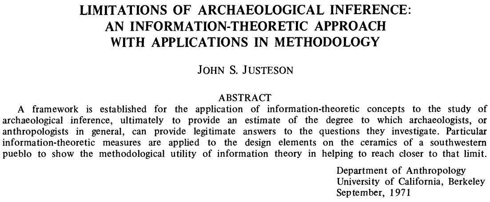

## Introduction

Fifty years ago, what was arguably one of the most important papers written for modern work in quantitative archaeology was published in American Antiquity. Unfortunately for its author, and generations of archaeologists, it received relatively little attention. With a small number of citations, more than half of which have occurred in just the last few years, its elegance and mathematical precision went largely unappreciated -- even by the growing cohorts of computational and quantitative archaeologists whose work would have greatly benefited from John's brilliant work.

John Justeson's 1973 article "Limitations of Archaeological Inference" was not only correct, even if the field at large hadn't realized it, but also still very much at the forefront of digital archaeology.

The premise was actually quite straightforward -- behavioral information is "encoded" in the material artifacts deposited within an archaeological site, and the archaeologist's motive is to "decode" that information on the other end.

The novelty was that John saw this "encoding-decoding" process as an information flow, which could be described by what was (at the time) a relatively esoteric set of mathematical tools known as *information theory*.

The foundations of information theory were developed by @Shannon1948 as a way to analyze the transmission of information *independently* of the content of the message.

> "The fundamental problem of communication is that of reproducing at one point either exactly or approximately a message selected at another point. Frequently the messages have meaning; that is they refer to or are correlated according to some system with certain physical or conceptual entities." [@Shannon1948, p.1]

John saw that this theory established a quantifiable "upper limit" on how interpretable archaeological data could be. We could actually *calculate* the limits of archeological inference.

> "If the empirically measured parameters are not consistent with the relationship between them that is required by the theory for a given material or behavioral system, then the data by which that system is to be interpreted cannot have a consistent susceptibility to decoding; that is, there will be no basis for deriving a coherent archaeological interpretation of the data that will accurately reflect the prehistoric situation." [@Justeson1973, p. 136]

In particular, he was addressing two *inherent* limitations of the archaeological record:

1. limitations imposed by the degree of preservation of culturally significant remains and by the skewing of their relationships through time until their recovery; and
2. limitations on the interpretability of archaeological data for the cultural descriptions.

The first limitation is analogous degradation of a signal due to noise or interference affecting a transmission, and the second to the encoding and decoding of that signal between sender and receiver.

## Information Theory

At the heart of information theory is a single equation  that aimed to quantify a measure of information based on the concept of *entropy* from the thermodynamics of physical systems:

$$
H(\cal{X}) = - \sum_{i=1}^{n} p(x_i) \log_2 p(x_i)
$$

The total information entropy $H$ of a system $\cal{X}$, which contains some number of discrete features or attributes ($x_{1}, x_{2}, \ldots x_{n}$), is defined as the negative sum over all features of each attribute's probability of occurrence $p(x_i)$ times the $\log$ of its probability.

What this does, although not immediately obvious to most of us, is to tell us the minimum number of "events" of that system that it would take before we could start detecting a pattern. The more events it would take, the less information each observation is actually giving us.

One easy way to think of it is that, for a high-entropy event we can't reasonably predict any individual occurrence of a completely random event -- i.e., *any* outcome is equally likely -- so we are likely to be *surprised* each time.

After *a lot* of observations we could make a fair prediction of the outcomes over a *large* number of events, but still couldn't accurately predict any single event. Each event gives us only a *small* amount of information, so we would need a large number of observations before we could distinguish it from some other system.

Conversely, it wouldn't take us too long to notice something that regularly (or never) occurs. Each event would tell us a *lot* of information, so we need fewer observations to see a pattern.

### Archaeological Information

## Channels, Classification, and Signal

![Schematic representation of information transmission [Fig. 1 @Justeson1973, p. 133].](Justeson_1973_figure_1.png)

$$
C = \max_{\pi} \left\lbrace \sum_j \left\lbrack\sum_i \pi_i w(j|i) \log_2 \sum_i \pi_i w(j|i) - \sum_i \pi_i w(j|i) \log_2 \sum_i \pi_i w(j|i)\right\rbrack \right\rbrace
$$

## Applications

$$
M_t = \sum^{T}_{i=t} N_i
$$

$$
L_t = \sum^{T}_{i=t} M_i
$$

