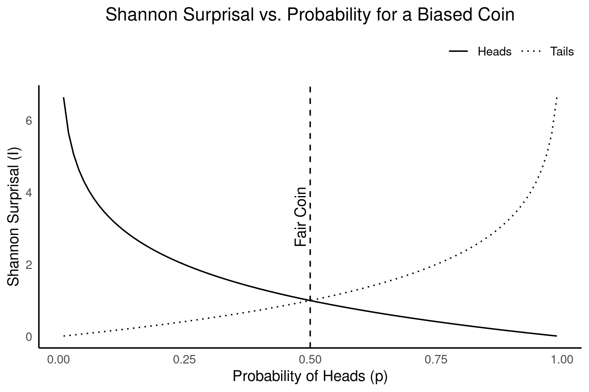

## A Gentle Introduction to Information Theory

What is now known as "Information Theory" began with a paper written by Claude Shannon, titled "A Mathematical Theory of Communication" [-@Shannon1948], resulting from his work in cryptography at Bell Labs. At the heart of Shannon's theory was the idea that *information* is fundamentally tied to the reduction of *uncertainty*. Shannon approached information not in terms of meaning, but as a measure of the *reduction of uncertainty* within a system of communication.

The influence of telecommunication and cryptography on Shannon's theories will become obvious, but the underlying concepts quickly found new applications and implications in other fields of study. By linking information to uncertainty and statistical probabilities, Shannon's abstracted and highly generalized model of information and communication could be adapted to studying all manner of systems. It would not be too long after the theories described in Shannon's technical paper were greatly expanded and republished the following year as "The Mathematical Theory of Communication" [@Shannon1949] that they would begin to appear in disciplines ranging from physics to physiology -- and, of course, eventually finding their way into archaeology.

### Information, Entropy, and Surprisal

Shannon proposed a particular relationship between information and uncertainty in terms of statistical probabilities. He derived a quantitative measure of that uncertainty derived from the concept of *entropy* used to describe disorder in the thermodynamics of physical systems. Shannon, however, repurposed entropy to refer to the average uncertainty contained in a system  given by the equation:  

\[
    H( \cal{X} ) = - \sum_{i=1}^{n} p(x_i) \ \log_2 \ p(x_i)
\]

What this equation is describing is the total entropy \( H \) of some system \( \cal{X} \) that contains \(n\) discrete attributes or elements \( (x_{1}, x_{2}, \ldots x_{n}) \). The entropy is equal to the negative of the sum, over all \(n\) features, of each element's probability of occurrence \( p(x_i) \) times the \( \log_2 \)[^fn01] of that probability.

[^fn01]: \( \log_2 \) refers to the base-2 logarithm.

The higher the entropy of a system, indicated by a larger value for $H$, the more uncertainty or randomness there is to the elements of \(\cal{X}\). Somewhat counterintuitively, the more uncertain or random a system the more information it conveys. Remember that Shannon defines information as the reduction of uncertainty. The greater the uncertainty (i.e., high entropy), the more potential information the system is capable of producing because there is greater uncertainty to reduce.

To see how, we need to understand what Shannon defined as *surprisal*. Surprisal, also known as self-information, is a measure of how surprising or unexpected a specific event is based on its probability. In essence, surprisal measures the information content of a specific outcome -- i.e., rare events carry more information than common ones because they are less expected. Low probability events, those that occur infrequently, are highly surprising. Conversely, high probability events are not.

Consider it this way -- if an event is nearly certain to occur, you would *already* be expecting it to happen when it does. Its occurrence tells you nothing that you did not already know. It is only when something happens that we did *not* expect (i.e., we are surprised) that it is providing *new* information. Therefore, surprisal (denoted as \(I(x)\)) is the potential *information* contained in a single event based on its probability \(p(x)\):

\[
    I(x) = - \log_2 p(x)
\]

Surprisal is zero for events that are certain (i.e., the probability \(p(x)=1\)), and grows larger as the probability of the event decreases (Figure {#figure:surprisal_example}). Exceedingly rare events, by contrast, would be very surprising to witness and approaching "infinitely" surprising as the probability of the event goes to zero (i.e., \(lim_{p(x) \to 0} \ I(x) = \infty\)).

{#figure:surprisal_example}

Entropy represents the *average* surprisal over all possible outcomes from a probability distribution.[^fn001] It quantifies the overall uncertainty or unpredictability of a system or source of information. The higher the entropy, the more information the system is capable of producing, since there is greater uncertainty about which outcome will occur.

[^fn001]: 

Entropy is highest when all outcomes are equally likely, and decreases as we gain more information to anticipate whether or not that event is likely to occur (Figure {#figure:entropy_example}). Information is therefore the reduction of that uncertainty or entropy when a new event is observed. We have learned more about the underlying probabilities for future events.

{#figure:entropy_example}

For the first time, scientists had a way to *quantify* information. Shannon had defined information in a way that made it possible to measure and *analyze* it mathematically, based solely on its statistical structure and independently of its content or meaning.

Information theory has evolved over the last few decades into a highly diverse discipline in its own right, with broad applications. Shannon, however, developed the theory towards one particular application -- communication. Specifically, he was looking for a way to understand how information could be efficiently and reliably transmitted across communication systems, especially in the presence of noise or interference.  

### Channel, Signal, and Noise

Under Shannon's model of communication, the relationships between information, channel, signal, noise, and channel capacity define the core aspects for transmitting data effectively. Information represents the content or message that needs to be conveyed, which can vary in complexity. In this context, entropy is a measure of the inherent complexity of the information a message might contain -- i.e., higher entropy indicates greater variability in *potential* messages.

A communication *channel* is the medium or system through which information is transmitted. Channels connect sender to receiver, and are characterized by their capacity to handle information. This *channel capacity* ( \( C \) ) represents that maximum rate at which information that may reliably be transmitted across that a channel. It places an upper bound on how much information can be sent through such a channel of communication with an arbitrarily low rate of errors, given by:  

\[
C = \max_{p(x)} I(X | Y)
\]

where \( I(X | Y) \) is the *mutual information*[^fn02] between the transmitted variable \( X \) and the received variable \( Y \). It measures the amount of information *shared* between \( X \) and \( Y \) or, put another way, how much of what was transmitted by the sender is retained and correctly *understood* by the receiver. The capacity \( C \) for the channel, then, is where maximum amount of information can be correctly transmitted with the fewest number of errors or misunderstandings by the receiver.

[^fn02]: Remember, \( I(x) = - \log_2 p(x) \) is the *surprisal* value of event \( x \) that represents the information conveyed by that event. The *mutual information* between two events \(I(X|Y)\) is the information provided by \(X\) when we *already* know that \(Y\) has occurred.

Information is transmitted across a communication channel as *signals*, which are encoded representations of the information. A signal is is defined as the physical embodiment of information that is transmitted across a communication channel from a sender to a receiver. Shannon treats signals as mathematical entities that *encode* data using a sequence of symbols, typically binary (0s and 1s), representing the discrete or continuous probability states of information. This encoding enables information to be manipulated, stored, and transmitted efficiently, with the ultimate goal of achieving maximum fidelity in the presence of noise or interference. Shannon's model abstracts signals into probabilistic terms, allowing for quantification of the information.

Channels, however, are not perfect. They can introduce disturbances known as *noise*, which interferes with the signal and can alter the received message, creating a challenge in accurate data transmission. The more noise present, the harder it is to reliably convey information. Noise is essentially random disturbances or fluctuations in the transmission of information along a channel that interfere with the signal. Noise can distort or obscure messages, increasing the probability of errors in decoding them.

Since channel capacity is the maximum rate at which information can be transmitted over a channel without errors, excess noise degrades capacity by introducing errors. So, channel capacity depends on both the *bandwidth* of the channel (i.e., the allowable range of possible signal frequencies) and the *signal-to-noise ratio* (often simply called "SNR"). Shannon's theory shows that for a channel to transmit information efficiently, the signal must be strong enough to overcome noise, but *not* so strong that it leads to unnecessary redundancy in the message encodings.

This balance maximizes the channel's capacity, allowing the most efficient transfer of information while minimizing error. This gives us another way[^fn03] to find a channel's capacity, given by:  

\[
    C = B \log_2 \left( 1 + \frac{S}{N} \right)
\]

where \( B \) is the bandwidth of the channel, \( S \) is the power of the signal, and \( N \) is the noise. The signal-to-noise ratio (SNR) \( \frac{S}{N} \) represents, a measure of how strong the signal is relative to the noise. As noise (\( N \)) gets larger relative to signal (\( S \)), the SNR starts dropping closer towards zero. Since \( \log_2 (1 + 0) = 0 \) that means that, no matter how large its ideal bandwidth, the channel's capacity \( C \) goes towards zero as well.

[^fn03]: This method of calculating channel capacity is more common (and often much more practical) in telecommunication applications, such as those Shannon was studying, in which such things as "channel bandwidth" and "signal power" can be directly measured or otherwise experimentally ascertained.

## A Brief History of Quantitative Analysis and Information Theory in Archaeology

The integration of quantitative methods into archaeology during the 20th century profoundly transformed the methods by which archaeologists tried to understand the past. By the 1950s, methodological innovations in quantifying archaeological analysis, in works such as @Brainerd1951 or @Heizer1956, highlighted the value of statistical frameworks in chronology-building and site analysis, establishing a precedent for rigorous quantitative inquiry in archaeology. This push intensified during the 1960s with the advent of the "New Archaeology" championed by figures such as Lewis Binford.

New Archaeology, later termed Processual Archaeology, advocated for an explicitly scientific approach grounded in hypothesis testing, formal quantification, and systems theory [@Kendall1969; @Binford1981; @Raab1984]. David Clarke's texts *Models in Archaeology* [-@Clarke1972] and *Analytical Archaeology* [-@Clarke1978] formalized these aspirations by advocating for complex statistical models and systems theory to provide explanatory frameworks in the study of past human behavior. By situating quantitative methods at the heart of analysis, Processual Archaeology sought to go beyond mere description to causal understanding, particularly through middle-range theories that sought correlations between artifacts and behavioral processes [@Binford1981; @Schiffer1983].

By the 1970s, quantitative archaeology had begun to consider some of the conceptual elements of Shannon's information theory, such as its introduction in Doran's [-@Doran1970] early applications of systems theory and simulation. @Justeson1973 notes the work of Fred @Gorman1970 as possibly the first *formal* mathematical application of Shannon's theory to the quantitative analysis of archaeological collections. Justeson's own offering [-@Justeson1973] explored the potential for information-theoretic concepts as a tool for addressing inferential challenges in archaeology. He demonstrated how Shannon's entropy measures could be applied to quantifying the integrity of archaeological *signals* by considering the formation of the archaeological record itself in terms of *channel* and *capacity*. The rapid developments in computer applications further fueled this expansion, facilitating the adoption of statistical methods across archaeological contexts [@Kintigh1982; @Kintigh1984; @Richards1998; @Djindjian2015].

The slow adoption and application of methods increasingly influenced by Shannon's information theory (albeit not often explicitly so) allowed archaeologists to assess patterns in artifact distribution and site organization with new mathematical precision, later inspiring applications in cultural transmission and inter-group interaction studies [@Dickens1984]. Through the 1980s, however,  critiques of quantitative and rigidly "science-like" approaches to cultural phenomena began to emerge, primarily from post-processual theorists who argued for subjective interpretations and a focus on agency and meaning rather than structural functionalism [@Klejn1977].

Despite such critiques, quantitative methods, including information-theoretic approaches, continued to evolve and become an indispensible feature of archaeological methods. In recent years, advances in entropy and information measures emerging from developments in machine learning and data science have been increasingly applied to artifact analysis, as seen in works such as @Paige2022 or @Rio2024, employing entropy to examine variability in stone tool production strategies. These newer studies align with a trend towards recognizing the flexibility of quantitative tools to address a broader array of archaeological questions, marking a shift away from the purely deterministic frameworks of early Processualism towards a more nuanced integration between methods and theories [@Nolan2020; @Gheorghiade2023].

From the 1950s to today, quantitative analysis in archaeology has progressed somewhat independently from larger theoretical movements and critiques. Rather than the overarching epistemological ambitions of the early "New" or Processual archaeologists for a scientific objectivism, quantitative methods have instead become part of the standard toolkit of contemporary archaeological practice.

### The Evolution of Information Theory in Archaeology

The integration of *formal* information theory into archaeological research has had a much slower evolution. In the late 1960s and early 1970s, inspired by Shannon's ideas, archaeologists began to experiment with these concepts to analyze the transmission of cultural traits, the integrity of artifacts, and the uncertainty inherent in archaeological data. More explicit and formal applications Shannon's model were much slower to appear. The mathematical and computational complexity of such models largely exceeded the capabilities at the time, and there remained substantial debate regarding their limitations in addressing the complexities of human behavior and cultural evolution.

Although not the first, Michael Schiffer's work [-@Schiffer1972] is likely the best known of the early applications of a theory of information in archaeology. He tried to formalize the disruption of information flow caused by post-depositional processes, termed as "systemic and archaeological contexts." Schiffer emphasized how the information contained within artifacts could degrade over time due to various environmental and cultural factors, introducing "noise" into the archaeological record. This idea aligned with Shannon's theory of communication, where noise distorts messages as they pass through a channel. Schiffer's subsequent work [-@Schiffer1983] on formation processes expanded on this, demonstrating how entropy, a measure of disorder, influences the amount of reliable information that survives in archaeological contexts.

Schiffer's book "Formation Processes of the Archaeological Record" [-@Schiffer1987] is still among the most influential applications of information concepts to archaeology, even though Schiffer did not explicitly use Shannon's framework. Schiffer introduced the idea that archaeological sites are the result of two key processes -- i.e, cultural formation processes involving human behaviors that create and modify archaeological deposits, and natural formation processes through non-human agents such as erosion or animal activity that affect the archaeological record.

The notion of information loss in these processes echoed Shannon's concepts of entropy and noise. Schiffer's emphasis on understanding how archaeological data are transformed before and after deposition mirrors the concerns of information theory regarding how signals are distorted through transmission. By conceptualizing the archaeological record as a series of transformations from its original state, Schiffer advanced a model that paralleled Shannon's information processing, where each formation process acts as a filter, introducing "noise" and altering the original "message."

John Justeson [-@Justeson1973], however, explicitly applied Shannon's concepts directly to archaeological inference by demonstrating and quantifying the theoretical limits of reconstructing past human behavior through fragmentary data. He focused on how entropy could quantify uncertainty and signal degradation, although he cautioned that oversimplification sometimes results when human complexity is reduced to mathematical models. Justeson's objective was to try and formalize the analysis of the inherent *limitations* of such interpretations. He derived a complete mathematical formulation to assess whether any given assemblage of archaeological features contained *sufficient* signal to rigorously identify underlying patterns. It directly addressed the tension between abstract quantitative frameworks and the nuances of particular cultural trajectories, a critique that has persisted in the field, but sought out a methodological compromise that could actually *quantify* that inherent uncertainty.

Justeson's work helped begin a dialogue within archaeology about the inherent limitations of inference from incomplete datasets [e.g., @Sullivan1978; @Plog1978; @Hayden1984], contributing to the development of more cautious and methodologically rigorous approaches to interpreting the archaeological record. His use of Shannon's ideas encouraged some archaeologists to critically evaluate the reliability of their data, and the extent to which they could justifiably infer past behaviors or cultural practices. Unfortunately, the sophisticated mathematical and computational understanding required for the article's *quantitative* implications and applications seems to have relegated it to relative obscurity. [^fn04]

[^fn04]: It is worth noting that John had published this article while still a graduate student at Stanford University, before completing his Masters. The article has seen a recent and substantial resurgence of attention, garnering more citations within the last ten years than it had in the previous four decades.

It would not be until the 1980s that other scholars substantially applied formal information theory to model cultural interactions. @Dickens1984 [notably citing @Justeson1973] used Shannon's idea of channel capacity to study the flow of cultural information in the Middle Woodland Period, seeking to quantify how much cultural interaction could be detected within the archaeological record. Similarly, @Renfrew1983 explored the idea of culture as a communication system, where information flows between individuals and groups. He applied Shannon's concept of information transmission to study how cultural signals travel and degrade over time, though he acknowledged the complexity of non-linear dynamics in human societies, which challenge the assumptions of equilibrium-based models.

More recently, the use of information theory in archaeology had broadened, particularly in studies of cultural transmission. @Crema2016 advanced Shannon's ideas by applying equilibrium and non-equilibrium models to study cultural transmission from frequency data. They used these models to reveal how cultural traits spread and stabilize within populations, providing quantitative insights into processes that are often difficult to observe directly in the archaeological record. Similarly, @Carrignon2023 used information theory to estimate transmission rates, applying Shannon's communication model to measure the uncertainty associated with the diffusion of cultural traits.

@Gheorghiade2023 expanded Shannon's concept of entropy into a framework they called "Entropology" that posits entropy measures to better understand archaeological data. They critique the traditional applications of information theory for focusing too narrowly on entropy without accounting for the broader complexity and uncertainty of archaeological contexts. This critique echoes the central debate surrounding the use of information theory in archaeology -- i.e., while it offers valuable tools for formalizing the study of cultural transmission and data integrity, it does not capture the intricate and chaotic nature of human historical exigencies.

Another major critique of these applications, such as that by @Raab1984, concerns the oversimplification of human behaviors when abstract models like those derived from Shannon's theories are applied. They argue that middle-range theory, which often uses these models, fails to capture the full complexity of human action. @Zubrow1972 similarly critiqued the difficulty of accounting for environmental and social variables when applying information-theoretic frameworks. Despite this, some scholars such as @Nolan2020 have proposed to refine these models. Nolan assessed entropy, noise, and channel capacity to evaluate the significance (in the technical and regulatory cultural resources sense of the term) of archaeological data, particularly focusing on how much information about past societies could be accurately recovered from the fragmented and noisy record.

The use of Shannon's information theory in archaeology has evolved from early models of data degradation and cultural transmission to more sophisticated frameworks that incorporate the entropy and uncertainty in teh archaeological record. Scholars like @Schiffer1972, @Justeson1973, and @Renfrew1983 laid the foundation, while modern researchers like @Nolan2020, @Crema2016, and @Gheorghiade2023 have expanded these concepts to address the challenges posed by incomplete and noisy archaeological records. However, the ongoing debate highlights the tension between the precision offered by information theory and the complex realities of human history, questioning the extent to which these mathematical models can truly capture the richness of the past.

Ironically, the ensuing debates largely failed to recall that one of them already provided a roadmap for determining *exactly* that extent quite early on in the venture.

## The Limitations of Archaeological Inference

In Justeson's 1973 article, he introduces Shannon's theory of communication as a means to formalize the analysis of inherent inferential limitations in archaeological interpretation. In the introduction, he firmly situates the paper within what was, at the time, growing theoretical tensions between conflicting goals within archaeology. Some were advocating for a "new" archaeology focused on "predictive behavioral science" while the "traditional" archaeology's aim was the reconstruction of "social and cultural histories" [@Justeson1973, p.131]. Justeson viewed the distinction as merely opposing "poles on a continuum of research commitments" and instead posed a slightly different question -- is there a way to determine whether or not we were actually capable of doing *either*, given a particular archaeological source?

The article is presented in two parts. The first ("A Theoretical Framework") introduces the relevant aspects of Shannon's theory of communication and posits the analogous relationships between those processes and the nature archaeological data. He makes the argument that it is not sufficient just to describe the archaeological record as an information channel, but that is is specifically a channel of a particular *type* that allow its interpretation. The second part ("Application of Information-Theoretic Measures") illustrates how specific measures for the fidelity or integrity of the archaeological record can be derived from Shannon's model. He presents a set of formal tools through which archaeologists could calculate these specific measures from observations of artifact attributes to determine whether sufficient information existed within an assemblage to be *interpretable*.

Rather than present a predominately conceptual framework, as previous works had done [e.g., @Doran1970; @Schiffer1972; @Clarke1973], the objectives of the article were more ambitious. Justeson aimed to use Shannon's formal models to demonstrate the specific properties and capabilities of the archaeological record to transmit information. Working backwards from the observation that the archaeological record functioned as a communication channel, he showed that such a channel must also possess the formal properties of a certain type of communication network. Furthermore, he showed that the encoding of information carried by that channel would need to take a particular form in order for it to successful convey interpretable information about the past. In essence, "...the archaeologist is in the position of the code-breaker tapping a channel with whose code he is not fully familiar by means of another channel" [@Justeson1973, p.134].

### "Part I -- A Theoretical Framework"

The paper builds from the hypothesis that archaeological interpretation is fundamentally limited by the quantity of information that can be extracted from the archaeological record. Like the other early archaeological invocations of information theory, Justeson described the archaeological record as a degraded and incomplete set of signals from past behavior that are transmitted through the "channel" of the archaeological record. Each artifact or feature would represent a small, noisy fraction of the original cultural system.

Justeson's main departure from the others was in that he applied Shannon's concept of entropy *directly* to the assessment of the degree of uncertainty that might be incorporated into archaeological interpretations simply by the nature of that channel. Remember, Shannon linked reduction of uncertainty to information. Justeson focused on highlighting how *noise* in the archaeological record -- due to processes such as taphonomy or excavation biases -- interacts with the inherent *entropy* entailed by the archaeological features or processes that *encode* past behaviors. Those interactions innately affect the *capacity* of the archaeological channel to reliably transmit information.

Therefore, the inherent limit of archaeological inference would be the limits (i.e., the "upper bound" in mathematical terms) of the channel's capacity given a certain amount of noise. Past those limits, *de*coding the source signal (i.e. the *behavior*) would become highly susceptible to more ambiguous, unreliable, or even spurious interpretations. To find -- and *calculate* -- that limit, Justeson needed to specify the nature of the transmission channel and its properties and identify (and prove) the existence of a coherent system of encoding.

The point that is easy to miss in this part of the paper is that Justeson's goal here is to provide a way to determine analytically whether or not an archaeological assemblage *meets those minimum requirements* to be considered a code *at all*. If not, "... there is really no basis for speaking of the existence of a channel" [@Justeson1973, p. 136]. This, above all else in the paper, represents Justeson's true theoretical and methodological challenge to the ambitions of the "New Archaeology" as a project. He is saying that unless we can *prove* that there is an *analytically* feasible code entailed by archeological data, there can *be* no supportable interpretation of it.

> If the empirically measured parameters are not consistent with the relationship between them that is required by the theory for a given material or behavioral system, then the data by which that system is to be interpreted cannot have a consistent susceptibility to decoding; that is, there will be no basis for deriving a coherent archaeological interpretation of the data that will accurately reflect the prehistoric situation. Thus, the question of the existence of a code is one of primary importance for our considerations. [@Justeson1973, p.136]

#### "Basic Concepts of Information Theory and Their Archaeological Correlates"

Whereas Shannon described information in terms of the reduction of uncertainty, Justeson notes that information can also be thought of in terms of *contrasts*. That is, information can be seen as a way we are able to distinguish the qualities or attributes of one type of thing from those of another. Information, then, is how we determine categories by reducing the uncertainty of correctly assigning a thing or event to a given category.

That information is, in the archaeological case, *encoded* through the deposition of an assemblage that reflects the material expressions of past behaviors as an input  message or source *signal*. The message or signal is transmitted across a channel, which has particular characteristics and limitations. These properties allow for the introduction of *noise* that may affect the input signal and alter or obscure the original message. Innate channel properties, along with any noise or distortion of the input signal, results in an output signal that is received and decoded on the other end as the output message (see {#figure:info-channel-schema}). Channel capacity, then, is a measure of how much information can be transmitted without errors (i.e., *input* \(=\) *output*).

![Schematic representation of information transmission ["Fig. 1" in @Justeson1973, p. 133].](Justeson_1973_figure_1.png){#figure:info-channel-schema}

Justeson points out, however, that archaeologists are actually dealing with *two* distinct communication systems. Essentially, the archaeological channel input is itself the *output* of the cultural system that *produced* the assemblage. The formation of archaeological deposits is preceded by a cultural encoding resulting in the production of the original assemblage, which is itself the material consequent of human behaviors. The archaeological record (i.e., *channel*) is therefore the *secondary* channel through which we, as archaeologists, are attempting to "break" the code of the original *behavioral* encoding with which we are unfamiliar.

#### "Channel Classification, Channel Properties, and Codes"

Describing the archaeological record as a "channel" is a useful abstraction, of course, but far more important is to identify the nature and properties of that channel. Shannon's work was describing a specific *type* of communication channel, one in which both the natural properties of the channel and the general system of encoding for signals were known. Telephone or radio transmissions are useful heuristics for understanding the basics of Shannon's theory, but neither are properly analogous to the archaeological case. For an archaeological channel, these are either unknowns or the *objective* of analysis.

To actually *model* the archaeological record as a communications channel, and to formalize how the potential capacity of such a channel might derived, required determining its specific type and properties. Futhermore, it required deriving a specification for the encoding of archaeological data that could generalize to the diversity of archaeological data types. Such a code would need to entail a probabilistic basis, as needed by Shannon's definitions for information, as well as reflect the particular nature of archaeological data and how it is recovered. Justeson discusses two general properties of communications channels that broadly distinguish channel types.

The first is whether or not the channel has what is referred to, in statistical terms, as *memory*. In a channel without memory, the elements of any signal or message are unaffected by any other or prior signals. Each transmitted signal is *independent* from any others. In probabilistic terms, this implies that each element or symbol in a message's transmission has a fixed probability distribution unaffected by earlier transmissions. This would make them statistically equivalent to a sequence of independent, identically distributed events. Conversely, in a channel with memory each transmission would potentially be altered by the conditional probability based on prior messages.

The second property is related to the allowable encoding of signals. These are distinguished by whether the set of symbols or elements used to form (i.e., encode) the signal are *finite* or *infinite*. This distinction is somewhat moot in the archaeological case since, as Justeson points out, "...the number of meaningful attributes in any material system is finite, and since both the input and output signals are material systems, then we can say that both the input and output alphabets [*i.e., set of symbols or elements*] are finite" [@Justeson1973, p.135]. Since there are a finite number of possible elements used to encode archaeological signals, the channel is described as *discrete* (as opposed to *continuous*). This primarily has the effect, for the purposes of analysis, of limiting the possible types of probability distributions involved. For archaeological assemblages, these would most often be attribute- or type-frequency probabilities. It also places certain constraints on the *memory* of the channel as well.

The memory of a discrete archaeological channel therefore requires a bit more consideration. In a discrete *memoryless* channel, the presence or absence of any given element or attribute would by definition be *independent* of the presence or absence of any other. That would mean, though, that "...their signals are undecipherable from our vantage point since, being independently transmitted, they show no differentiation or special clustering on any level; independence implies only random associations" [@Justeson1973, p.135]. Justeson also observes, however, that the memory of an archaeological channel would also have to be finite. Otherwise, the accumulation of noise within the channel over time would eventually render any subsequent signals uninterpretable.

Instead, he suggests, the more appropriate channel type would be a discrete *decreasing-memory* channel, in which prior events have less influence over time. Channels with decreasing memory are often analyzed through the lens of *ergodic processes* and *Markov models*, which help in quantifying the rate at which the influence of the past diminishes. These models would be beneficial in applications where the channel environment evolves slowly over time, where the channel state may vary due to factors like mobility or environmental changes [@Cover2001]. Unless, however, the rate of decreasing memory is constant -- i.e., they are *stationary*, which Justeson notes is not an appropriate assumption for human behavior -- such models are highly complex and computationally difficult to analyze.

That leaves the specification of what an archaeological *code* might look like, and it is here where Justeson *really* starts to take a deep dive into the mathematical details.[^fn06] The definitions for code and channel capacity that Justeson presents are derived from @Wolfowitz1961, which require some explanation. A code has to conform to certain minimum requirements for it to be predictably encoded and decoded as a signal.

[^fn06]: This is also the point, we expect, that many people (including this chapter's authors) might originally have had some difficulty in following the logic of the article. It requires a certain level of comfort with mathematical and set notation, some basic understanding of set theory, background in statistical and graphical analysis, and a general familiarity with rhetorical style of how mathematical models and proofs are presented. John himself had been a dual-major in anthropology and probability theory as an undergraduate at U.C. Berkeley, so was already well-versed in the "language" so to speak.

The requirements for a code are deceptively simple:  

1. it must allow *uniquely* distinguishable (i.e., "disjoint") sequences of symbols, attributes, or events to be sent and received; and
2. the probability that any given message received over the channel is the same as the unique sequence that was sent must be \(\geq 0\).

The first requirement (i.e., *uniqueness*) means that any given sequence of symbols, whether sent or received, can only encode and be decoded as one (and only one) message. The same sequence of symbols cannot have multiple possible decodings, nor can one decoding come from different input sequences. In mathematical terms, then, a signal consists of \(N\) combinations (i.e., "ordered pairs") of unique input sequences \(u_i\) (sent) and unique output sequences \(A_i\) (received), where \(i=1,...,N\). This is written as  

\[
    \biggl \lbrace (u_1, A_1), \ldots, (u_N, A_N) \biggr \rbrace
\]

Each input \(u_i\) and output \(A_i\) signal comprised of \(n\) symbols used for the encoding -- e.g, letters in an alphabet, binary digits, or some other uniquely identifying attribute or feature.

The second requirement brings in the probabilistic aspect of information theory. There must be a way to describe a *probability* for whether a sequence sent (\(u_i\)) will match the correct *de*coding (\(A_i\)). This is given by  

\[
    P \left \lbrace v(u_i) \in A_i \right \rbrace \geqslant 1 - \lambda, \ i=1,\ldots,N
\]

where \(v(u_i)\) is what is *actually* received when \(u_i\) is sent, \(P \lbrace v(u_i) \in A_i \rbrace\) is the probability that \(v(u_i)\) matches the correct decoding \(A_i\), and \(1-\lambda \geq 0\) is a constraint on the allowed range of probabilities (i.e., to be a probability at all, \(\lambda \geq 0\) and \(\leq 1\)).

As long as those two requirements are both met, then it is a legitimate code with parameters \(n\) (the lengths of sequences), \(N\) (the number of sequences or messages), and \(\lambda\) (the measure of probabilities).

If we can find a way to determine or estimate those three parameters (\(n\),\(N\),\(\lambda\)), and they meet the two theoretical requirements, then we are able to identify that there *is* an underlying code and channel to the archaeological assemblage that can be decoded and interpreted. In the archaeological case, though, we don't have the source or input sequence \(u_i\), which means we do not yet have a way to find \(\lambda\).

We do have the output signals \(A_i\) (i.e., the observed archaeological data), meaning we have at least an observation of what the *minimum* vales for \(n\) (e.g., how many observable symbols, attributes, features, etc.) and \(N\) (effectively, the sample population) could be. Logically, if we expect potential loss in a signal due to noise (i.e., some symbols or messages are dropped) then the input parameters should be *at least* the values observed from the output. What we still need to find is their *upper* limits.

Now we get back to why it was important to figure out the *type* of channel we are dealing with. For a *discrete finite-memory channel*, the values of \(n\) and \(N\) have a very specific relationship between them given by  

\[
    N = 2^{n(C-\epsilon)}
\]

in which we have two new variables. The first is the channel capacity from Shannon's information theory \(C\), and the second a positive constant \(\epsilon\) that basically represents some amount of signal loss.

This relationship between \(n\) and \(N\) defines the nature of this type of channel, and tells us that the signals received \(N\) depend on the length of the sequences \(n\) weighted by how much of the channel's capacity is left after losses to noise, interference, or mistranslation \(C-\epsilon\). As long as the parameters that we can derive from our observed output signals (i.e., the archaeological record) don't violate that relationship, then we have a legitimate code and channel that can be decoded and interpreted.

The maximum *possible* number of unique combinations for the elements of any set (e.g., an alphabet), without repeating any elements, is \(2^n\) where \(n\) is how many things there are *in* the set.[^fn07] For \((C - \epsilon)\) to constrain the resulting value for \(N\) below that[^fn08] its value would have to be greater than zero and less than one.

[^fn07]: This can obviously get very big, very quickly. For example the english alphabet, with 26 letters, has \(2^{26}\) or \(67,108,864\) possible unique combinations if you are only using any letter only once in any sequence!

[^fn08]: Remember, the channel capacity is an *upper limit* for transmission along the channel.

Next we need to be able to figure out or estimate our channel capacity. Recall that Shannon defined channel capacity as the maximum of the mutual information between signals sent and received \(C = \max_{p(x)} I(X|Y)\). Justeson substitutes the appropriate equation of mutual information for discrete probabilities in finite sets:  

\[
    C = \max_{\pi} \left \lbrace \sum_j \left \lbrack \sum_i \pi_i \omega(j|i) \log_2 \sum_i \pi_i \omega(j|i) - \sum_i \pi_i \omega(j|i) \log_2 \ \pi_i \omega(j|i) \right \rbrack\ \right \rbrace
\]

where \(\pi = (\pi_1, \ldots  ,\pi_k)\) is the probability distribution for each of the \(k\) symbols of the input encoding, and \(\omega(j|i)\) is the probability of receiving \(j\) if \(i\) is sent (\(j\) can also be be null).[^fn09] Justeson notes that we can calculate \(C\) "...often only with great labor..." [-@Justeson1973, p.136], and used a more computationally efficient method for finding its upper limit from @Helgert1967.[^fn10]

[^fn09]: The notation used for this equation may be somewhat confusing, in part because the notation is different from that used previously to describe codes. In the second equation, \(j\) would be the same as \(A_i\) and \(i\) would be \(u_i\). The expression \(\omega(j|i)\) is another way to express each probability in \(P \lbrace v(u_i) \in A_i \rbrace\).

[^fn10]: It isn't really necessary to understand all of what is going on in this rather complex equation, only that it is an analytical way to calculate a specific value for capacity from the tabulation of observable probabilities.

Advances in both the power of computers and the development of optimized methods for handling large systems of equations now make these calculations relatively straightforward matters, but we are left with our archaeological problem -- we do not have access to the source signals, only the outputs, so we do not know *what* was sent. We do now know what we are looking for in order to determine if our archaeological data is a legitimate and interpretable code and prove that the archaeological record constitutes a viable channel to transmit that code.

The second part of @Justeson1973 shows us how to go about finding it.

### "Part II -- Application of Information-Theoretic Measures"

By way of demonstration, the second part of @Justeson1973 applies the principles of information theory to a specific archaeological assemblage. This is essentially a "proof of concept" application of quantitative measures to see whether a real collection of artifacts can be shown to reflect an underlying "code" and "signal" under the formal definitions of information theory. He chose to analyze the design elements for a collection of pottery sherds, since differences in such design and decorative elements are typically considered to distinguish between particular systems of cultural traditions and practices. They should, therefore, be an ideal test case to see if they can be shown to be a coherent system for encoding behavioral information in the formal sense. The sample assemblage came from the 1970 excavations at the Joint Site in Arizona, a large 36-room pueblo occupied form roughly 1100 to 1300 A.D. [@Justeson1973, p. 136].

If the theory holds, then analysis of the design elements should show that they constitute a coherent code by which to encode a signal. That, in turn, would prove that the archaeological record constitutes a viable channel for the transmission of such codes as  archaeological signals from past behavioral systems. If, however, no such code can be proven then one of those underlying assumptions is mistaken. In other words, archaeological interpretation is inherently limited by whether or not there is sufficient information in the observed elements or attributes of the archaeological data to identify the mere existence of a code a all. If not, then there is not enough information to discriminate patterns in the data -- without consistent patterns, no feasibly legitimate interpretations. Without a code, there is *nothing to decode*.

#### "Extrapolation of the Prehistoric Distribution of Design Elements"

Before the existence of a code can be determined, though, we have to figure out how many symbols or tokens there are in the system that we suspect *could* be a code. In Justeson's example, that means finding a way to extrapolate how many distinct design elements of pottery there are. Archaeologically, we likely only have a sample or *subset* of the original array of design elements -- we can never be quite sure that we have examples of *all* of them. Instead, we need to *estimate* how many there were (i.e., the original "population" of elements) by extrapolating from the observable sample that we do have. Moreover, we need to also estimate how common each element was likely to occur. Estimating a population from a sample is, of course, a common statistical problem.

Justeson adapted a method from Mackay's [-@Mackay1965] technique used to estimate the number of symbols there were in an unknown script from the characters found on the Phaistos Disc.[^fn11] It is simply based on how frequently each of the attributes occur in the sample (in this case, pottery design elements). This allows an extrapolation, from observed data, to estimate the number of total attributes in the source's system of codes. As an extrapolation, it does entail an initial assumption the the observable frequencies reflect a consistent and predictable underlying distribution.

The estimates are based on the distribution of the *frequencies* rather than the attributes themselves. By adding up the *number* of elements \(N_t\) that occur exactly \(t\) times, we get the number of elements that occur *at least* \(t\) times (\(M_t\)) in the assemblage. This is expressed mathematically as:  

\[
    M_t = \sum^{T}_{i=t} N_i
\]  

[^fn11]: This technique is simple to implement and provides quick and reasonably accurate estimates. The reason, statistically, is that it leverages a common (though not fully understood) attribute of rank-frequency distributions that they tend to follow an exponential or power law distribution -- e.g., Zipf's law or a Pareto distribution. Basically, if you made 100 observations of 20 attributes, all 20 would occur at least once but very few would be likely to occur all 100 times. There are more robust and accurate methods of estimating these sorts of distributions available now, but the basic principle still holds true -- if events or attributes are not random, their frequency of occurrence will decay exponentially.

We do this for \(t=1\) (every element is observed at least once) up to the frequency of the most common element \(T\) (i.e., the largest count of any element). For \(t=1\), \(M_1\) will equal the total number of elements observed in the sample. What we are trying to extrapolate or estimate is a value for \(M_0\), or the expected total number of elements in the original *population* including the ones that we have not seen.

Next, we want to calculate the total number of *observations* of elements that have occurred at least \(t\) times (\(L_t\)). This is a cumulative sum as well, so we add up every value of \(M\) from \(t\) to \(T\):  

\[
    L_t = \sum^{T}_{i=t} M_i
\]

Again, \(L_1\) is equal to the total number of observations in the sample. In general, the exact value for \(L_t\) is interesting only inasmuch as it describes the overall distribution of observations. Technically, the value indicates the remaining number of observations if \(t - 1\) observations were removed from each of the \(N_i\) frequencies [from @Mackay1965, described above].

You will note that \(N_i\), \(M_t\), and \(L_t\) all remove any link or reference to the original attributes or encodings. Information theory is, by *design*, only concerned with the statistical and probabilistic  properties of signals and channels. It is, effectively, a *meaning-* or *content-free* analysis of the transfer of information between source and receiver, irrespective of the meaningful content of those signals and messages. The goal is, instead, to ascertain the mere *existence* of viable information and transfer. Justeson's goal was to show that a code and channel are viable and sufficient to transmit archaeological information -- i.e., to *reduce the uncertainty* regarding the past behaviors encoded by the archaeologic record.

To those ends, the *frequency* of occurrences -- rather than the codes themselves -- are the object of the analysis. Empirical distributions of \(M\) and \(L\) form the basis from which to extrapolate \(M_0\) (the full systems number of feature attributes) to make reasonable inferences about the distribution of those attributes in the original (i.e., the unobserved) system. We are working towards estimating the parameters needed to calculate the overall channel capacity and determine the noise affecting the signal. Without the source signal's probabilities, we have to effectively "reverse engineer" the channel from the receiving end.

The last thing we need then is to estimate the distribution of those frequencies across all of the system's elements. To do this we compare the ranking of those frequencies (\(r\)) -- ordered from highest frequency to lowest -- and the observed frequencies for each element \(p(r)\).[^fn12] We needed a value for \(M_0\) to be able to "fix" one end of the distribution of those frequencies with a point \(p(M_0+1)\) = 0 so that we can estimate the *ideal* or natural frequency distribution of the system \(p_E(r)\).[^fn13]

[^fn12]: The frequencies of the elements were scaled by the overall minimum and maximum values to be between 0 and 1.

[^fn13]: If we expect that there are \(M_0\) elements in the system, then the frequency of an element with a rank greater than \(M_0\) would logically have to be zero.

From here, it is a matter of fitting a curve to each of these empirical distributions to find the extrapolated values for \(M_0\) and \(L_0\). Once we have those, we can generate an estimate for the distribution of values in the source signal's rank-frequency distribution \(p_E(r)\).

These days, it is a relatively straightforward matter to fit a curve or distribution to data points using statistical software on just about any available computer. At the time the article was written, however, it required manually fitting from a physical template of ideal curves, which would be laid over the points plotted onto graph paper to find the best fit. Arguably a bit subjective, but in practice nearly as accurate and (with a large enough sheet of graph paper) surprisingly precise.[^fn14]

[^fn14]: To give a sense of the difficulties in analog graph curve fitting -- "The graph paper used was about 11 ft long, that scale allowing an extrapolation to five decimal places." [@Justeson1973, p.140]

The goal of all of this effort was, in fact, to *find* that estimated distribution \(p_E(r)\). It represents our "best guess" as to what the original distribution of elements might have in the past, sight unseen. With that in hand, we now have a reasonable approximation for the *source* encoding and signal of the original archaeological deposition. That allows us to (finally) begin applying information theory proper to find out whether there is too much "noise" in the archaeological channel to transmit a reliable signal and if what we have is ultimately a feasible code.

#### "Noise Levels"

Now that we have an empirical estimate for the source code's rank-frequency distribution, we have the means to evaluate the *noise* incurred by passing the signal through our archaeological channel. To do so, we need to compare the ranked frequencies of the signal received \(p(r)\) with our extrapolation of the signal sent \(p_E(r)\). Noise is simply any interference between source and received signal, so all that we are doing is evaluating what proportion of what was observed to what we expect was sent. Justeson uses the definition for conditional probability, and a few simple and reasonable assumptions, to define a measure for the noise \(\psi(r)\) related to each ranked element \(r\).

\[
    \begin{aligned}
        \psi(r) &= P(\text{receiving design element} \ r \ \text{given that} \ r \ \text{was sent})\\
        &=P(\text{receiving} \ r \ | \ r \ \text{was sent})
    \end{aligned}
\]  

We don't actually know that probability of receiving what was sent yet, though. We only know that we received element \(r\), and (the simple assumption) we would not have *unless* \(r\) was sent (i.e., we have \(P(r \ \text{sent and} \ r \ \text{received})\)).[^fn15] It may seem a subtle distinction, but it actually does change the mathematics of the probabilities involved. Luckily, there is an easy solution provided by the following definition:  

\[
    P(A|B) = P(A \ \text{and} \ B) \div P(B)
\]  

[^fn15]: This is a logical assumption, "...since we do not expect to find different design elements in any instance than those that were applied by the prehistoric painter" [@Justeson1973, p. 140]. It is not a trivial one, though. It is conceivable that post-deposition processes might result in something that *appears* to be a design element, but is not in fact. While this scenario would be considered an effect of noise in the channel, its implications should also be considered in archaeological interpretations.

This is known as the *conditional probability* of an event. In other words, it is the probability \(P\) of event \(A\) if we know event \(B\) has already happened (i.e., \(p(A|B)\) or "probability of \(A\) *given* \(B\)"). This is equal to the probability that \(A\) and \(B\) occur together (\(P(A \ \text{and} \ B)\) or \(P(A \cup B)\)) divided by the probability that \(B\) happens (\(P(B)\)). This means, by this definition for conditional probability, that:  

\[
    \begin{aligned}
    P(r \ \text{sent and} \ r \ \text{received}) &= P(r \ \text{sent} \ | \ r \ \text{received}) \times P(r \ \text{received}) \text{, or alternatively} \\
    &= P(r \ \text{received} \ | \ r \ \text{sent}) \times P(r \ \text{sent}) \\
    \end{aligned}
\]  

The rather convenient result of this is that  

\[
    P(r \ \text{received} \ | \ r \ \text{sent}) \times P(r \ \text{sent}) = P(r \ \text{sent} \ | \ r \ \text{received}) \times P(r \ \text{received})
\]  

which means  

\[
    P(r \ \text{received} \ | \ r \ \text{sent}) = \frac{P(r \ \text{sent} \ | \ r \ \text{received}) \times P(r \ \text{received})}{P(r \ \text{sent})}
\]  

Justeson defined our noise factor \(\psi(r)\) as \(P(r \ \text{received} \ | \ r \ \text{sent})\), and we're making the assumption that we don't receive an element unless it was sent, so \(P(r \ \text{sent} \ | \ r \ \text{received})=1\). \(P(r \ \text{received})\) is our observed rank-frequency \(p(r)\), and \(P(r \ \text{sent})\) is just the extrapolated rank-frequency \(p_E(r)\). Substituting the terms leaves us with our measure for noise  

\[
    \psi(r) = \frac{p(r)}{p_E(r)}
\]  

You might be wondering, at this point, why it is necessary to go through so much trouble to measure noise. Remember that for something to constitute a valid code it has to have a reasonable chance to be *de*coded. In the earlier definition of a code, this is the parameter \(\lambda\). The probability of accurate decoding, \(p \lbrace v(u_i) \in A_i \rbrace \), has to be greater than or equal to \(1-\lambda\). The larger \(\lambda\), the less chance of accurate decoding. In our case, that means finding the smallest ratio of \(p(r)\) to \(p_E(r)\), or \(\min_r \psi(r)\), which basically represents the "worst" decoding in our observations.

Since \(\psi(r)\) is equivalent to \(p \lbrace v(u_i) \in A_i \rbrace \), which must be \(\geq 1-\lambda\), then it must be that  

\[
    \lambda \leq 1 - \min_r \psi(r)
\]  

In other words, the bigger the difference between our observed frequencies at rank \(r\) and its estimated frequency the more noise has prevented accurate decoding. Like a chain, our potential code is only as good as its weakest link so the smallest (i.e., worst) value of \(\psi(r)\) is our benchmark.[^fn16] In the design element data for the Joint site, \(\min_r \psi(r) = 0.5059\) and so \(\lambda = 0.4941\).

[^fn16]: @Justeson1973 provides a more rigorous proof of \(\min_r \psi(r) = 1-\lambda\), but we have opted for a more intuitive description of the logic.

We now have an estimate for one of the parameters to determine if the archaeological sample constitutes a code. Actually, we have estimates for *two* of the parameters now. By extrapolating \(M_0=122\), the number of elements in the source's encoding, we have an estimate for the second parameter out of the three (\(n\)) as well.

At this point, we are also able calculate the upper bound on our archaeological channel. Justeson referred to Helgert's [-@Helgert1967] method for finding the bound, but noted that it would take too much discussion to explain. That is true here as well, but in short the channel capacity \(C\) is equal to the sum of the probabilities that a code received was the one sent times the \(\log_2\) of the number of codes.[^fn17] The number of codes is simply our extrapolated \(M_0\), and the probability that we received what was sent is just \(\psi(r)\). This gives us a version of Helgert's method  

\[
    C \leq \left ( 1 - \sum_r \psi(r) \right ) \times \log_2(M_0)
\]  

In Justeson's sample, that works out to \(C \leq 6.6438\) providing us with a metric of the upper *limit* for the channel capacity (i.e., has to be "less than or equal to...").

[^fn17]: Helgert's method is based in linear algebra and some special properties of matrices, which in this particular case greatly simplifies the calculations because of the way \(\psi(r)\) is defined.

<!-- >
\[
    \begin{aligned}
    \min_r \ \psi(r) &= \min_r \biggl \lbrack P(r \ \text{received} \ | \ r \ \text{sent}) \biggr \rbrack \\
    &= \min_r \biggl \lbrack 1 - P(r \ \text{not received} \ | \ r \ \text{sent}) \biggr \rbrack \\
    &= \max_r \biggl \lbrack P(r \ \text{not received} \ | \ r\ \text{sent}) \biggr \rbrack\\
    &= 1- \lambda
    \end{aligned}
\]
>
> ... the observed values should never be higher than the extrapolated, and that the mean value should be \(1\), since  
>
\[
    \begin{aligned}
    \overline{\psi} &= \sum_r p_E(r) \psi(r) \\
    &= \sum_r p_E(r) \left \lbrack p(r) \div p_E(r) \right \rbrack \\
    &= \sum_r p(r) = 1
    \end{aligned}
\] -->

#### "Existence of a Code"

This section is very brief but incredibly important to the paper's thesis. It succinctly presents a deceptively simple argument that even incomplete data may still constitute a viable encoding and signal to transmit information. We have now been able to extrapolate or estimate two of the code parameters (\(\lambda, n\)), estimates of both the rank-frequencies and noise factors (\(p_E(r), \psi(r)\)), and calculated the channel capacity \(C\). To determine whether or not our observed data represents a valid code, however, we still need the one remaining code parameter \(N\).

Here, we run into a bit of an archaeological dilemma due to the nature of the sample -- i.e., we don't have a way to extrapolate or estimate \(N\) directly. The sample of design elements from the Joint site come from pottery sherds rather than whole vessels, which means that each observation is *not* a complete sequence. Recall that \(N\) represents the number of \(n\)-length sequences available in the code, so the lack of complete sequences means that we do not have any way to even *estimate* \(N\).

Justeson obviates the problem by reframing the question as whether there is a combination of values, given what we know, for which some viable value of \(N\) is feasible. Wolfowitz's definition [-@Wolfowitz1961] of the relationship between \(n\) and \(N\) for a discrete finite-memory channel is that \(N=2^{n(C-\epsilon)}\). That relationship *must* hold true given the values for \(n\) and \(C\) that we have extrapolated from the received data, or it cannot be a valid code. In other words, the question we need to answer is whether there *can be* any value of \(\epsilon\), given \(n\) and \(C\), that would result in a feasible value for \(N\). Since this is a discrete channel, that means \(N\) has to be an integer \(geq 1\) and \( \leq 2^n\) (the maximum number of possible combinations for \(n\) elements).

For values of channel capacity \(C\) and \(\epsilon\) to reduce \(N\) below that \(2^n\) maximum (i.e., be "restrictive"), \((C-\epsilon)\) would have to be \(\geq 0\) and less than \(1\). That value of \(\epsilon\) has to be between \(0\) and \(C\) so, as long as \(C\) is greater than \(1\), all of the possible values of \(\epsilon\) would result in a valid potential value for a real (albeit unknown) \(N\)  and we have a legitimate code.

<!-- > The value of \(C - \epsilon\) must be less than \(1\) to be at all restrictive, since \(2^n\) is the number of different combinations than can be gotten from \(n\) elements, so that there will always be at most \(2^n\) code words. Since the value of \(\epsilon\) must lie between \(0\) and \(C\), our range of values for \(N = 2^{n(C - \epsilon)}\) is not limited any further. There will, therefore, at least if \(C > 1\), be a value of \(\epsilon\) for which the actual value of \(N\) is achieved, so that a code does exist in this case. -->

<!-- #### Information Distortion -->

<!-- #### System Dynamics -->

<!-- \[
    \begin{aligned}
    H' &= -\sum_{i=1}^k p(x_i) \log_2 p(x_i) \\
    &= -\sum_{i=1}^k \frac{1}{k} \log_2 \frac{1}{k} \\
    &= -\log_2 \frac{1}{k} \\
    &= \log_2 k
    \end{aligned}
\]

\[
    h = H/H' \ \text{and} \ h_E = H_E/H'_E
\]

##### Binary Coding and Its Applications

> To set up the binary code for an attribute system, the attributes should first be ranked by frequency from highest to lowest; then the frequencies are divided into 2 groups with equal frequency totals, or with totals as nearly equal as is possible. The first group receives the code digit 0, and is made up of the higher-frequency elements, the second receives the digit 1 and is made up of the lower-frequency elements. Then the process is applied to each of these subgroups, and then continually to the resulting subgroups until all the attributes have been isolated in single-attribute groups. This process is represented schematically by Fig. 6. The binary codings themselves are given in Tables 1 and 2.
>
> Given this data we compute \(H^*\), the information content of the system in terms of binary coding, or, in other words, the maximum information retrievable for a given frequency distribution, by the formula  
\[
    H^* = \sum_{i=1}^k p(x_i) b(x_i)
\]
> where \( b(x_i) \) is the number of digits in the binary code for attribute xi, and the other quantities the formula are as in the last section. The ration \( h^* = H/H^* \) is then a measure of the coding efficiency.
> -->

<!-- ## Introduction

...

* Quantitative approaches in archaeology beginning with Petrie's application of sequence dating (i.e., seriation) in 1899 [@Kendall1969].
* It was not until the 1950s that formal statistical methods started to play a more substantial role in archaeological methodologies [@Ammerman1992]. Early work by archaeologists such as @Brainerd1951, @Spaulding1953, and @Heizer1956 foreshadowed an emergent *computational archaeology* [@Djindjian2015].
* By the 1970s
* 

Fifty years ago, what arguably could have been one of the most important papers written for modern work in quantitative archaeology was published in American Antiquity. Unfortunately for its author, and generations of archaeologists, it received relatively little attention at the time. With few citations, more than half of which have occurred in just the last few years, its elegance and mathematical precision went largely unappreciated.

John Justeson's article "Limitations of archaeological inference: an information-theoretic approach with applications in methodology" [-@Justeson1973] was rather ambitious, as can be seen from its abstract:

> "A framework is established for the application of information-theoretic concepts to the study of archaeological inference, ultimately to provide an estimate of the degree to which archaeologists, or anthropologists in general, can provide legitimate answers to the questions they investigate. Particular information-theoretic measures are applied to the design elements on the ceramics of a southwestern pueblo to show the methodological utility of information theory in helping to reach closer to that limit." [@Justeson1973]

The premise was actually quite straightforward -- behavioral information is "encoded" in the material artifacts deposited within an archaeological site, and the archaeologist's goal is to "decode" that information on the other end. The novelty was that John saw this "encoding-decoding" process as an information flow that could be described by what was (at the time) a relatively esoteric set of mathematical tools known as *information theory*.

The foundations of information theory were developed by Claude Shannon as a way to analyze the transmission of information *independently* of the content of a message.

> "The fundamental problem of communication is that of reproducing at one point either exactly or approximately a message selected at another point. Frequently the messages have meaning; that is they refer to or are correlated according to some system with certain physical or conceptual entities." [@Shannon1948, p.1]

Justeson saw that this approach might also be used to establish an "upper limit" for how interpretable archaeological data could be. Moreover, he demonstrated that we could reasonably calculate a quantifiable *measurement* for that upper limit from those data.

> "If the empirically measured parameters are not consistent with the relationship between them that is required by the theory for a given material or behavioral system, then the data by which that system is to be interpreted cannot have a consistent susceptibility to decoding; that is, there will be no basis for deriving a coherent archaeological interpretation of the data that will accurately reflect the prehistoric situation." [@Justeson1973, p. 136]

In other words, observed archaeological features or attributes should represent a coherent and systematic pattern of activities. If not, then there would be no viable and supportable interpretation for that data available to archaeologists.

In particular, he was addressing two *inherent* limitations of the archaeological record:

1. limitations imposed by the degree of preservation of culturally significant remains and by the skewing of their relationships through time until their recovery; and
2. limitations on the interpretability of archaeological data for the cultural descriptions.

The first limitation is analogous degradation of a signal due to noise or interference affecting a transmission, and the second to the encoding and decoding of that signal between sender and receiver.

@Schiffer1972 had previously elaborated on the distinction between *systemic* and *archaeological* contexts, differentiating between the cultural and taphonomic processes that create the observable archaeological record. It would not be until a decade later [@Schiffer1983; @Schiffer1987] that he would formalize these as *natural* versus *cultural* transformation processes (i.e., $n$-transforms and $c$-transforms). @Justeson1973 ... -->
