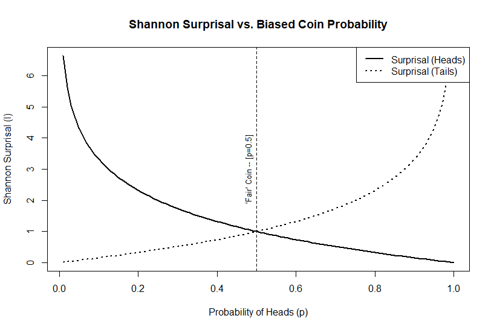

## Introduction

Fifty years ago, what arguably could have been one of the most important papers written for modern work in quantitative archaeology was published in American Antiquity. Unfortunately for its author, and generations of archaeologists, it received relatively little attention at the time. With few citations, more than half of which have occurred in just the last few years, its elegance and mathematical precision went largely unappreciated.

John Justeson's article "Limitations of archaeological inference: an information-theoretic approach with applications in methodology" [-@Justeson1973] was rather ambitious, as can be seen from its abstract:

> "A framework is established for the application of information-theoretic concepts to the study of archaeological inference, ultimately to provide an estimate of the degree to which archaeologists, or anthropologists in general, can provide legitimate answers to the questions they investigate. Particular information-theoretic measures are applied to the design elements on the ceramics of a southwestern pueblo to show the methodological utility of information theory in helping to reach closer to that limit." [@Justeson1973]

The premise was actually quite straightforward -- behavioral information is "encoded" in the material artifacts deposited within an archaeological site, and the archaeologist's goal is to "decode" that information on the other end. The novelty was that John saw this "encoding-decoding" process as an information flow that could be described by what was (at the time) a relatively esoteric set of mathematical tools known as *information theory*.

The foundations of information theory were developed by Claude Shannon as a way to analyze the transmission of information *independently* of the content of a message.

> "The fundamental problem of communication is that of reproducing at one point either exactly or approximately a message selected at another point. Frequently the messages have meaning; that is they refer to or are correlated according to some system with certain physical or conceptual entities." [@Shannon1948, p.1]

Justeson saw that this approach might also be used to establish an "upper limit" for how interpretable archaeological data could be. Moreover, he demonstrated that we could reasonably calculate a quantifiable *measurement* for that upper limit form those data.

> "If the empirically measured parameters are not consistent with the relationship between them that is required by the theory for a given material or behavioral system, then the data by which that system is to be interpreted cannot have a consistent susceptibility to decoding; that is, there will be no basis for deriving a coherent archaeological interpretation of the data that will accurately reflect the prehistoric situation." [@Justeson1973, p. 136]

In other words, observed archaeological features or attributes should represent a coherent and systematic pattern of activities.

In particular, he was addressing two *inherent* limitations of the archaeological record:

1. limitations imposed by the degree of preservation of culturally significant remains and by the skewing of their relationships through time until their recovery; and
2. limitations on the interpretability of archaeological data for the cultural descriptions.

The first limitation is analogous degradation of a signal due to noise or interference affecting a transmission, and the second to the encoding and decoding of that signal between sender and receiver.

@Schiffer1972 had previously elaborated on the distinction between *systemic* and *archaeological* contexts, differentiating between the cultural and taphonomic processes that create the observable archaeological record. It would not be until a decade later [@Schiffer1983; @Schiffer1987] that he would formalize these as *natural* versus *cultural* transformation processes (i.e., $n$-transforms and $c$-transforms). @Justeson1973 ...

## A Gentle Introduction to Information Theory

What is now known as *Information Theory* largely began with a seminal paper written by Claude Shannon, titled "A Mathematical Theory of Communication" [-@Shannon1948] resulting from his work in cryptography at Bell Labs. At the heart of Shannon's theory was the idea that *information* is fundamentally tied to the reduction of *uncertainty*. Shannon approached information not in terms of meaning, but as a measure of the *reduction of uncertainty* within a system of communication.

Specifically, he proposed a particular relationship between information and uncertainty in terms of statistical probabilities. He derived a quantitative measure of that uncertainty derived from the concept of *entropy* used to describe disorder in the thermodynamics of physical systems. Shannon, however, repurposed entropy to refer to the average uncertainty contained in a system  given by the equation:  

$$
H(\cal{X}) = - \sum_{i=1}^{n} p(x_i) \ \log_2 \ p(x_i)
$$

What this equation is describing is the total entropy $H$ of some system $\cal{X}$ that contains $n$ discrete attributes or elements $(x_{1}, x_{2}, \ldots x_{n})$. This is defined as the negative sum over all features of each element's probability of occurrence $p(x_i)$ times the $\log_2$[^fn01] of that probability.

[^fn01]: $\log_2$ refers to the base-2 logarithm.

The higher the entropy of a system, indicated by a higher value of $H$, the more uncertainty or randomness there is to the elements of $\cal{X}$. Somewhat counterintuitively, the more uncertain or random a system the more information it conveys. Remember that Shannon defines information as the reduction of uncertainty. The greater the uncertainty (i.e., high entropy), the more potential information the system is capable of producing because there is more uncertainty to reduce.

To see how, we need to understand what Shannon defined as *surprisal*. Surprisal, also known as self-information, is a measure of how surprising or unexpected a specific event is based on its probability. In essence, surprisal measures the information content of a specific outcome -- i.e., rare events carry more information than common ones because they are less expected. Low probability events, those that occur infrequently, are highly surprising. Conversely, high probability events are not.

Consider it this way -- if an event is nearly certain to occur, you would *already* be expecting it to happen when it does. Its occurrence tells you nothing that you did not already know. It is only when something happens that we did *not* expect (i.e., we are surprised) that it is providing *new* information. Therefore, surprisal (denoted as $I(x)$) is the potential *information* contained in a single event based on its probability $p(x)$:

$$ I(x) = - \log_2 p(x) $$

Surprisal is zero for events that are certain (i.e., the probability $p(x)=1$), and grows larger as the probability of the event decreases (Figure {#figure:surprisal_example}). Exceedingly rare events, by contrast, would be very surprising to witness and approaching "infinitely" surprising as the probability of the event goes to zero (i.e., $lim_{p(x) \to 0} \ I(x) = \infty$).

{#figure:surprisal_example}

Entropy represents the *average* surprisal over all possible outcomes from a probability distribution. It quantifies the overall uncertainty or unpredictability of a system or source of information. The higher the entropy, the more information the system is capable of producing, since there is greater uncertainty about which outcome will occur.

Entropy is highest when all outcomes are equally likely, and decreases as we gain more information to anticipate whether or not that event is likely to occur (Figure {#figure:entropy_example}). Information is therefore the reduction of that uncertainty or entropy when a new event is observed. We have learned more about the underlying probabilities for future events.

{#figure:entropy_example}

For the first time, scientists had a way to *quantify* information. Shannon had defined information in a way that made it possible to measure and *analyze* it mathematically, based solely on its statistical structure and independently of its content or meaning.

## Information Theory in Archaeology

<!-- ### The Evolution and Critical Debate of Information Theory in Archaeology -->

<!-- The integration of information theory into archaeological research has evolved significantly since its early application in the 1970s. Inspired by Shannon's foundational ideas on information, entropy, and communication channels, archaeologists have employed these concepts to analyze the transmission of cultural traits, the integrity of artifacts, and the uncertainty inherent in archaeological data. However, the application of these ideas has sparked substantial debate regarding their limitations in addressing the complexities of human behavior and cultural evolution.

Michael Schiffer's pioneering work [-@Schiffer1972] marked one of the earliest uses of information theory in archaeology, where he explored the disruption of information flow caused by post-depositional processes, termed as "systemic and archaeological contexts." Schiffer emphasized how the information contained within artifacts could degrade over time due to various environmental and cultural factors, introducing "noise" into the archaeological record. This idea aligned with Shannon's theory of communication, where noise distorts messages as they pass through a channel. Schiffer's subsequent work [-@Schiffer1983] on formation processes expanded on this, demonstrating how entropy, a measure of disorder, influences the amount of reliable information that survives in archaeological contexts.

Michael Schiffer's seminal work "Formation Processes of the Archaeological Record" [-@Schiffer1987] is among the most influential applications of information theory concepts to archaeology, even though Schiffer did not explicitly use Shannon's framework. Schiffer introduced the idea that archaeological sites are the result of two key processes: cultural formation processes, which involve human behaviors that create and modify archaeological deposits, and natural formation processes, which are the non-human agents, such as erosion or animal activity, that affect the archaeological record. The notion of information loss in these processes echoes Shannon's concepts of entropy and noise. Schiffer's emphasis on understanding how archaeological data are transformed before and after deposition mirrors the concerns of information theory regarding how signals are distorted through transmission. By conceptualizing the archaeological record as a series of transformations from its original state, Schiffer advanced a model that paralleled information processing, where each formation process acts as a filter, introducing "noise" and altering the original "message."

John Justeson [-@Justeson1973] applied Shannon's concepts more directly to archaeological inference, investigating the limitations of reconstructing past human behavior through fragmentary data. He focused on how entropy could quantify uncertainty and signal degradation, critiquing the oversimplification that sometimes results when human complexity is reduced to mathematical models. This early work identified the tension between abstract, quantitative frameworks and the nuances of cultural history, a critique that has persisted in the field.

John Justeson's The Limitations of Archaeological Interpretation [-@Justeson1973] explicitly drew on Shannon's ideas, applying them to the challenges archaeologists face in reconstructing past human behaviors from material remains. Justeson argued that archaeological interpretation is fundamentally limited by the quantity of information that can be extracted from the archaeological record. He viewed the archaeological record as a degraded and incomplete set of signals, with each artifact or feature representing a small, noisy fraction of the original cultural system. Justeson applied Shannon's concept of entropy to assess the degree of uncertainty in archaeological interpretations, highlighting how increasing entropy in the archaeological record—due to processes such as taphonomy or excavation biases—leads to more ambiguous or unreliable interpretations.

Justeson's work helped establish a dialogue within archaeology about the inherent limitations of inference from incomplete datasets, contributing to the development of more cautious and methodologically rigorous approaches to interpreting the archaeological record. His use of Shannon's ideas encouraged archaeologists to critically evaluate the reliability of their data and the extent to which they could justifiably infer past behaviors or cultural practices.

In the 1980s, other scholars applied information theory to model cultural interaction. @Dickens1984 used Shannon's idea of channel capacity to study the flow of cultural information in the Middle Woodland Period, seeking to quantify how much cultural interaction could be detected within the archaeological record. Similarly, @Renfrew1983 explored the idea of culture as a communication system, where information flows between individuals and groups. He applied Shannon's concept of information transmission to study how cultural signals travel and degrade over time, though he acknowledged the complexity of non-linear dynamics in human societies, which challenge the assumptions of equilibrium-based models.

By the 21st century, the use of information theory in archaeology had broadened, particularly in studies of cultural transmission. @Crema2016 advanced Shannon's ideas by applying equilibrium and non-equilibrium models to study cultural transmission from frequency data. They used these models to reveal how cultural traits spread and stabilize within populations, providing quantitative insights into processes that are often difficult to observe directly in the archaeological record. Similarly, @Carrignon2023 used information theory to estimate transmission rates, applying Shannon's communication model to measure the uncertainty associated with the diffusion of cultural traits.

A major critique of these applications, as articulated by Raab and Goodyear (1984), concerns the oversimplification of human behaviors when abstract models like those derived from Shannon's theories are applied. They argue that middle-range theory, which often uses these models, fails to capture the full complexity of human action. @Zubrow1972 similarly critiqued the difficulty of accounting for environmental and social variables when applying information-theoretic frameworks. Despite this, modern scholars such as @Nolan2020 have worked to refine these models. Nolan assessed entropy, noise, and channel capacity to evaluate the significance of archaeological data, particularly focusing on how much information about past societies could be accurately recovered from the fragmented and noisy record.

More recently, @Gheorghiade2023 expanded Shannon's concept of entropy into a framework they called "Entropology," which applies entropy measures to better understand archaeological data. They critique the traditional applications of information theory for focusing too narrowly on entropy without accounting for the broader complexity and uncertainty of archaeological contexts. This critique echoes the central debate surrounding the use of information theory in archaeology: while it offers valuable tools for formalizing the study of cultural transmission and data integrity, it often struggles to capture the intricate and chaotic nature of human history.

In summary, the use of Shannon's information theory in archaeology has evolved from early models of data degradation and cultural transmission to more sophisticated frameworks that incorporate entropy and uncertainty. Scholars like Schiffer, Justeson, and Renfrew laid the foundation, while modern researchers like Nolan, Crema, and Gheorghiade have expanded these concepts to address the challenges posed by incomplete and noisy archaeological records. However, the ongoing debate highlights the tension between the precision offered by information theory and the complex realities of human history, questioning the extent to which these mathematical models can truly capture the richness of the past.

| #  | Paper                                                                                      | Key Insight                                                                                                                                              | Citations |
|----|---------------------------------------------------------------------------------------------|----------------------------------------------------------------------------------------------------------------------------------------------------------|-----------|
| 1  | [Crema, Kandler & Shennan (2016)](https://doi.org/10.1038/srep39122)                        | Applied equilibrium and non-equilibrium models to cultural transmission, revealing cultural patterns through frequency data.                               | -         |
| 2  | [Justeson (1973)](https://doi.org/10.2307/279360)                                           | Explored the limitations of information theory in archaeological inference, emphasizing the role of noise and uncertainty in reconstructing behavior.       | -         |
| 3  | [Nolan (2020)](https://doi.org/10.1007/s11135-020-00980-0)                                  | Assessed entropy, noise, and channel capacity in evaluating the significance of archaeological data and its degradation over time.                         | -         |
| 4  | [Schiffer (1972, 1983)](https://doi.org/10.2307/278203)                                     | Investigated how post-depositional processes disrupt information flow in artifacts, introducing the concept of formation processes in archaeological theory.| -         |
| 5  | [Carrignon, Bentley & O'Brien (2023)](https://doi.org/10.1016/j.jaa.2023.101545)            | Used information theory to estimate cultural transmission rates and measure the uncertainty in archaeological data.                                        | -         |
| 6  | [Raab & Goodyear (1984)](https://doi.org/10.2307/280018)                                    | Critiqued the over-reliance on middle-range theories and abstract models in capturing the complexity of human behaviors in archaeological records.          | -         |
| 7  | [Gheorghiade et al. (2023)](https://doi.org/10.1007/s10816-023-09627-4)                    | Proposed the concept of "Entropology" to move beyond simple entropy measures, emphasizing the need to account for complexity and uncertainty in the data.    | -         | -->

## Channels, Classification, and Signal

![Schematic representation of information transmission [Fig. 1 @Justeson1973, p. 133].](Justeson_1973_figure_1.png)

$$
\biggl \lbrace (u_1, A_1), \ldots, (u_N, A_N) \biggr \rbrace
$$

$$
P \big \lbrace v(u_i) \in A_i \big \rbrace \geqslant 1 - \lambda, i=1, \ldots,N
$$

$$
C = \max_{\pi} \left\lbrace \sum_j \left\lbrack\sum_i \pi_i w(j|i) \log_2 \sum_i \pi_i w(j|i) - \sum_i \pi_i w(j|i) \log_2 \sum_i \pi_i w(j|i)\right\rbrack \right\rbrace
$$

## Applications

### Extrapolation of the Prehistoric Distribution of Design Elements

$$
M_t = \sum^{T}_{i=t} N_i
$$

$$
L_t = \sum^{T}_{i=t} M_i
$$

### Noise

<!-- calculate noise factor for each design element -->

$$
\begin{aligned}
    \psi(r) &= P(\text{receiving design element r given that r was sent})\\
    &=P(\text{receiving r} \ | \ \text{r was sent})
\end{aligned}
$$

$$
\begin{aligned}
P(A|B) = &P(A \ \text{and} \ B) \div P(B) \text{, so} \\ 
&P(\text{r sent} \ | \ \text{r received}) \cdot P(\text{r received})\\
= &P(\text{r sent and r received})\\
= &P(\text{r received} \ | \ \text{r sent}) \cdot P(\text{r sent}) \\
\end{aligned}
$$

$$
\begin{aligned}
\min_r \psi(r) &= \min_r P(\text{r received} \ | \ \text{r sent}) \\
&= \min_r 1 - P(\text{r not received} \ | \ \text{r sent}) \\
&= \max_r P(\text{r not received} \ | \ \text{r sent}) \\
&= 1- \lambda
\end{aligned}
$$

$$
\begin{aligned}
\overline{\psi} &= \sum_r p_E(r) \psi(r) \\
&= \sum_r p_E(r) \left \lbrack p(r) \div p_E(r) \right \rbrack \\
&= \sum_r p(r) = 1
\end{aligned}
$$

$$
\begin{aligned}
H' &= -\sum_{i=1}^k p(x_i) \log_2 p(x_i) \\
&= -\sum_{i=1}^k \frac{1}{k} \log_2 \frac{1}{k} \\
&= -\log_2 \frac{1}{k} \\
&= \log_2 k
\end{aligned}
$$

$$
h = H/H' \ \text{and} \ h_E = H_E/H'_E
$$
